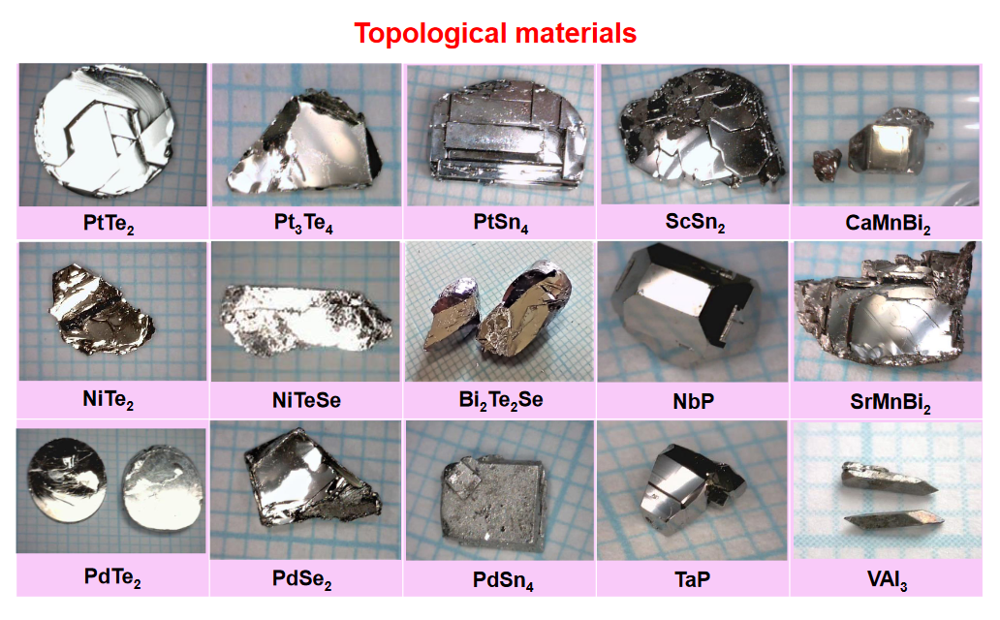
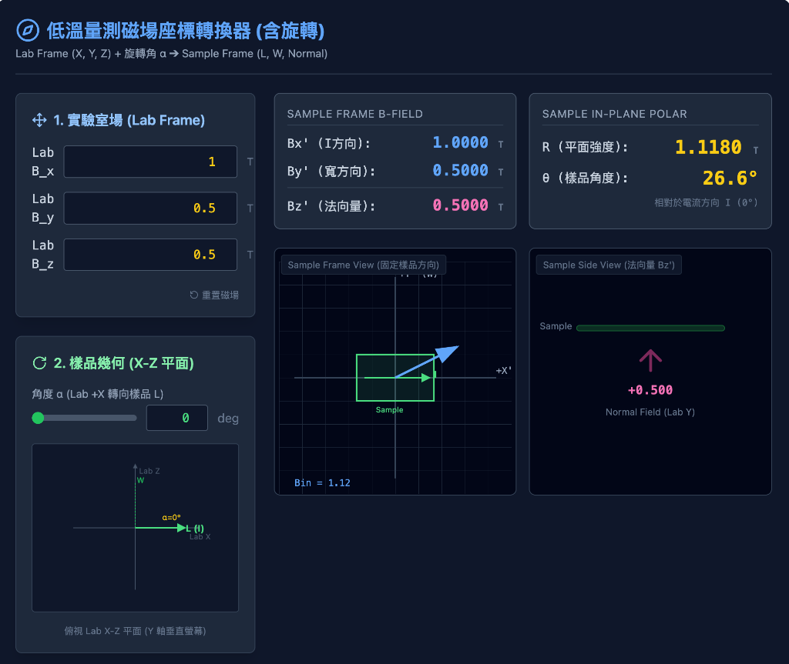
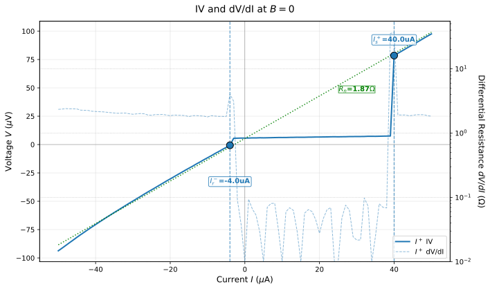
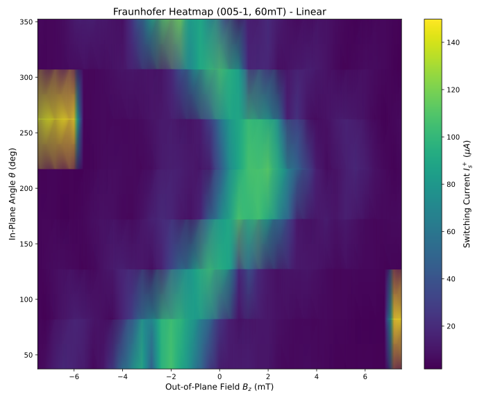
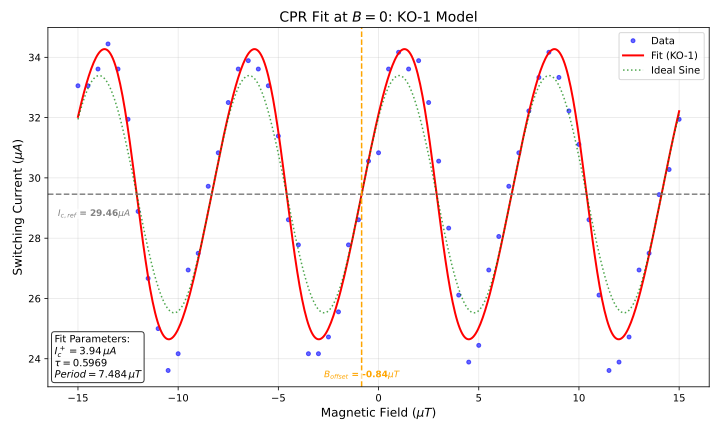

# Introduction

## Outline

::::: columns
::: {.column width="25%"}
### Introduction
- Research motivation
- 1T-PtTe$_2$ (Type-II Dirac)
:::

::: {.column width="25%"}
### Theory
- Josephson effect & CPR
- Josephson diode effect
:::

::: {.column width="25%"}
### Methods
- Device fabrication
- Measurement setup
:::

::: {.column width="25%"}
### Results
- Basic characterization
- CPR analysis
- In-plane field effect
:::
:::::

## Research Motivation

::::: columns
::: {.column width="33%"}
### Topological SC
- Type-II Dirac semimetal **PtTe$_2$** proximitized by a superconductor
- Platform for novel quantum transport (surface/edge states)
:::

::: {.column width="33%"}
### CPR
- Direct probe of junction physics beyond simple $\sin\phi$
- Harmonics encode transparency / Andreev bound states
:::

::: {.column width="33%"}
### Diode Effect
- Non-reciprocal transport $I_c^+ \neq |I_c^-|$
- Route to dissipationless rectification & SC electronics
:::
:::::

## 1T-PtTe$_2$: A Type-II Dirac Semimetal

::::: columns
::: {.column width="60%"}
*   **Crystal Structure**:
    *   Layered Transition Metal Dichalcogenide (TMD).
    *   CdI$_2$-type trigonal structure ($P\bar{3}m1$).
    *   Te-Pt-Te tri-layers bound by van der Waals forces.
*   **Electronic Properties**:
    *   **Type-II Dirac Fermions**: Lorentz-invariance violating tilted Dirac cones.
    *   High conductivity and potential topological surface states (TSS).
:::

::: {.column width="40%"}

:::
:::::

# Theoretical Background

## Josephson Effect & Current–Phase Relation

::::: columns
::: {.column width="50%"}
### Josephson relations
- DC: $I_s = I_c\sin\phi$ (ideal tunnel junction)
- AC: $\dot{\phi} = \frac{2e}{\hbar}V$
:::

::: {.column width="50%"}
### Beyond sinusoidal CPR
- High transparency → **skewed** CPR
- Harmonics: $I(\phi)=\sum_n I_n\sin(n\phi+\delta_n)$
- Access via **asymmetric SQUID** readout
:::
:::::

## Josephson Diode Effect (Concept)

::::: columns
::: {.column width="50%"}
### Definition
- Non‑reciprocal critical current  
  $I_c^+ \neq |I_c^-|$
- Superconducting rectification without Joule heating
:::

::: {.column width="50%"}
### Typical ingredients
- Broken inversion symmetry + broken time‑reversal symmetry
- Often tuned by $B_{\parallel}$ with strong spin–orbit coupling
:::
:::::

# Theoretical Model: Rashba + Zeeman

## Rashba + Zeeman: Why We Care

* Platform: 2D electron system at an interface (e.g. PtTe$_2$ surface / S–PtTe$_2$ junction)
* Key ingredients:
    * Strong spin–orbit coupling (SOC) → Rashba effect
    * External magnetic field → Zeeman effect
* Combined effect:
    * Generates **helical spin–momentum locking + spin splitting**
    * Breaks **inversion** and **time-reversal** symmetries → allows **finite-momentum pairing** and **Josephson diode effect (JDE)**

## Minimal 2D Model (Rashba + Zeeman)

* Momentum in plane: $\mathbf{k} = (k_x, k_y)$
* Spin Pauli matrices: $\boldsymbol{\sigma} = (\sigma_x, \sigma_y, \sigma_z)$
* Total Hamiltonian:
  $$
  H(\mathbf{k})
  = \underbrace{\frac{\hbar^2 k^2}{2m} - \mu}_{H_0}
  + \underbrace{\alpha_R (k_y\sigma_x - k_x\sigma_y)}_{H_R}
  + \underbrace{\tfrac{1}{2} g\mu_B \mathbf{B}\cdot\boldsymbol{\sigma}}_{H_Z}.
  $$
* We will discuss:
    * $H_0$: Free 2D electron gas
    * $H_R$: Rashba spin–orbit coupling
    * $H_Z$: Zeeman coupling to external magnetic field

## Free 2D Electron Gas ($H_0$)

* Hamiltonian:
  $$
  H_0 = \frac{\hbar^2 k^2}{2m} - \mu,\quad k^2 = k_x^2 + k_y^2.
  $$
* Symmetries:
    * **Time-reversal symmetry (TRS)**: preserved
    * **Inversion / mirror symmetry** (including $z \to -z$): preserved if structure is centrosymmetric
    * **Spin SU(2) symmetry**: full spin-rotation invariance
    * **In-plane rotational symmetry** (if effective mass isotropic): approx. preserved
* Physical picture:
    * Spin-degenerate parabolic bands
    * No spin–momentum locking; spin and momentum are independent

## Rashba Term ($H_R$): Origin and Form

* Requires **structural inversion asymmetry (SIA)** + strong SOC
* Rashba Hamiltonian:
  $$
  H_R = \alpha_R (\boldsymbol{\sigma}\times\mathbf{k})\cdot\hat{\mathbf{z}}
  = \alpha_R (k_y\sigma_x - k_x\sigma_y).
  $$
* Parameters:
    * $\alpha_R$: Rashba coupling strength $\propto$ interfacial electric field $E_z$
* Physical effect:
    * **Spin–momentum locking in the plane**:
        * Spin lies in-plane and perpendicular to momentum
    * Splits the spin-degenerate Fermi surface into two helically polarized Fermi circles

## Rashba: Symmetry Breaking

* **Breaks structural inversion symmetry** (SIA):
    * Under $z \rightarrow -z$: interfacial electric field $E_z$ changes sign
    * Rashba coupling $\alpha_R$ changes sign → $H_R$ is not inversion-invariant
* **Breaks full spin SU(2) symmetry**:
    * Spin no longer freely rotates; spin orientation is tied to momentum direction
    * Only combined spin–orbital rotations may remain as approximate symmetries
* **Preserves time-reversal symmetry (TRS)**:
    * Under $\mathcal{T}$: $\mathbf{k} \to -\mathbf{k}$, $\boldsymbol{\sigma} \to -\boldsymbol{\sigma}$
    * $H_R(\mathbf{k}) \to H_R(-\mathbf{k})$ → TRS holds
    * Kramers degeneracy: states at $\mathbf{k}$ and $-\mathbf{k}$ remain degenerate

## Zeeman Term ($H_Z$): Origin and Form

* External magnetic field $\mathbf{B}$ couples to spin:
  $$
  H_Z = \frac{1}{2} g\mu_B \mathbf{B}\cdot\boldsymbol{\sigma}
  = \frac{1}{2}g\mu_B(B_x\sigma_x + B_y\sigma_y + B_z\sigma_z).
  $$
* Examples:
    * In-plane field along $y$: $H_Z^{(y)} = \tfrac{1}{2} g\mu_B B_y \sigma_y$.
* Physical effects:
    * Spin-splitting of bands
    * Polarization of spins along $\mathbf{B}$
    * Modifies Fermi surfaces for spin-up and spin-down differently

## Zeeman: Symmetry Breaking

* **Breaks time-reversal symmetry (TRS)**:
    * Magnetic field $\mathbf{B}$ is odd under time reversal
    * With $\mathbf{B} \neq 0$, the system is no longer invariant under $\mathcal{T}$
    * Lifts Kramers degeneracy
* **Reduces spin SU(2) to U(1)**:
    * Only spin rotations about the $\mathbf{B}$ axis remain symmetric
    * Spin is preferentially aligned parallel or antiparallel to $\mathbf{B}$
* **Spatial symmetries**:
    * Depending on the crystal, $\mathbf{B}$ selects a preferred axis
    * May break certain rotational or mirror symmetries (e.g. in-plane mirrors) depending on direction of $\mathbf{B}$

## Rashba + Zeeman Together

* Combined Hamiltonian:
  $$
  H(\mathbf{k})
  = \frac{\hbar^2k^2}{2m} - \mu
  + \alpha_R (k_y\sigma_x - k_x\sigma_y)
  + \frac{1}{2} g\mu_B \mathbf{B}\cdot\boldsymbol{\sigma}.
  $$
* Symmetry summary:
    * **Inversion symmetry** (along $z$): broken by Rashba
    * **Time-reversal symmetry**: broken by Zeeman (finite $\mathbf{B}$)
    * **Spin SU(2)**: strongly broken; only residual rotations around special axes
* Physical consequences:
    * Spin texture becomes **helical + spin-split**
    * Fermi surfaces for opposite spins are shifted and distorted
    * This structure is the microscopic origin of:
        * **finite-momentum Cooper pairing** ($q \neq 0$)
        * **$\phi_0$-shifted and second-harmonic CPR**
        * **Josephson diode effect (JDE)**

## Connection to Finite-Momentum Pairing

* In presence of Rashba + Zeeman:
    * Spin–momentum locking: spin orientation tied to $\mathbf{k}$
    * Zeeman shifts spin-split Fermi surfaces in momentum space
* Result:
    * Cooper pairs formed between time-reversed partners no longer centered at $q=0$
    * Effective pair momentum:
      $$
      \mathbf{q}(\mathbf{B}) \propto \mathbf{B}_{\parallel},
      $$
      e.g. $q_x \propto B_y$ for certain helical textures
* In the Josephson junction:
    * Additional phase:
      $$
      \delta(B) \simeq 2\mathbf{q}(B)\cdot \mathbf{L},
      $$
    * Appears in CPR as:
      $$
      I(\phi) = I_1\sin\phi + I_2\sin(2\phi + \delta).
      $$
    * This is the GL-level description used to model JDE in PtTe$_2$ / NiTe$_2$ junctions.

## Symmetry & JDE (Summary)

* **Two key symmetry breakings for JDE / $\phi_0$-junction:**
    1. **Inversion symmetry broken** → Rashba SOC
    2. **Time-reversal symmetry broken** → Zeeman field
* Rashba + Zeeman together:
    * Generate helical spin–momentum locking + finite-$q$ pairing
    * Lead to a CPR containing higher harmonics and phase shifts:
      $$
      I(\phi) = I_1\sin\phi + I_2\sin(2\phi + \delta),
      $$
    * Allow nonreciprocal critical current:
      $$
      I_c^+ \neq |I_c^-| \quad\Rightarrow\quad \text{Josephson diode effect}.
      $$
* Take-home message:
    * **Rashba = inversion breaking + SOC**
    * **Zeeman = time-reversal breaking**
    * **Combination is the microscopic mechanism for JDE**

# Experimental Methods

## Device Fabrication Flow

1.  **Crystal Growth**: Self-flux method (provided by Prof. C.S. Lue, NCKU).
2.  **Exfoliation**: Mechanical exfoliation of PtTe$_2$ flakes onto SiO$_2$/Si substrates.
3.  **E-beam Lithography (EBL)**:
    *   PMMA resist coating.
    *   Pattern definition for contacts and SQUID loops.
4.  **Metallization**:
    *   Superconducting electrodes: **Al (Aluminum)** or **Nb (Niobium)**.
    *   *In-situ* Ar ion milling to ensure transparent interfaces.
    *   E-beam evaporation & Liftoff.
5.  **Design**: Asymmetric dc-SQUID geometry for CPR retrieval.

## Measurement Setup

::::: columns
::: {.column width="55%"}
- **Cryogenic system**: Dilution refrigerator (base **~40 mK**)
- **Electronics**: low-noise filtering, 4-terminal measurement
- **Magnetic control**: 3-axis vector magnet  
  (precise $B_{\parallel}$ and $B_{\perp}$ alignment)
:::

::: {.column width="45%"}
{width=95%}
:::
:::::

# Results: Basic Characterization

## I-V Characteristics (DC Transport)

*   **Typical IV Curve**:
    *   Clear Superconducting branch ($V=0$).
    *   Switching Current ($I_c$) and Retrapping Current ($I_r$).
    *   Hysteretic behavior (underdamped junction).

::::: columns
::: {.column width="50%"}

:::
::: {.column width="50%"}
*   **Observation**:
    *   Sharp transition indicates high-quality junction.
    *   Finite resistance in normal state ($R_N$).
    *   **Excess Current** observed at high bias $\rightarrow$ High transparency interface.
:::
:::::

## Fraunhofer Pattern (AC Josephson Effect)

::::: columns
::: {.column width="45%"}
- **Field modulation**: $I_c$ vs. out-of-plane $B_{\perp}$
- **Pattern cues**
  - Regular lobes → initially uniform current distribution
  - Deviations → non-uniformity / phase winding changes
:::

::: {.column width="55%"}
{width=100%}
:::
:::::

# Results: Current-Phase Relation

## CPR Retrieval Method

*   **Asymmetric SQUID Technique**:
    *   Large junction ($I_{ref}$) // Small junction ($I_{test}$).
    *   $I_c(\Phi_{ext}) \approx I_{ref} + I_{test}(\phi)$.
    *   Assumes $I_{ref} \gg I_{test}$ and sinusoidal $I_{ref}(\phi)$.
*   **Math Model**:
    $$ I_s(\phi) = I_1 \sin(\phi) + I_2 \sin(2\phi + \delta) $$
    *   $I_1$: Fundamental component (conventional).
    *   $I_2$: Second harmonic (4$\pi$-periodic / ABS).

## Measured CPR & Fitting

::::: columns
::: {.column width="50%"}

:::
::: {.column width="50%"}
*   **Key Findings**:
    *   **Skewed CPR**: Deviation from pure sine wave.
    *   **High $I_2/I_1$ ratio**: Significant second harmonic component detected.
    *   Indicates presence of highly transparent Andreev Bound States (ABS).
:::
:::::

# Results: In-Plane Magnetic Field Effect

## Tunable CPR with In-Plane Field

::::: columns
::: {.column width="45%"}
- Applying $B_{\parallel}$ **modifies CPR shape**
- Suggests a **phase shift** ($\phi_0$) in higher harmonics
- Correlates with emergence of the **Josephson diode effect**
:::

::: {.column width="55%"}
{width=100%}
:::
:::::

## Josephson Diode Effect (JDE)

*   **Definition**: Non-reciprocal critical current ($I_c^+ \neq |I_c^-|$).
*   **Mechanism**:
    *   Inversion symmetry breaking (structural or field-induced).
    *   Time-reversal symmetry breaking ($B$-field).
    *   Finite momentum Cooper pairs?
*   **Result**:
    *   Efficiency $\eta = \frac{I_c^+ - |I_c^-|}{I_c^+ + |I_c^-|}$.
    *   Tunable by magnetic field angle and magnitude.

# Conclusion

## Summary

1.  **Successful Fabrication**:
    *   High-quality 1T-PtTe$_2$ Josephson junctions and SQUIDs realized.
2.  **Anomalous CPR**:
    *   Observed significant **second harmonic** ($I_2$) contribution.
    *   Direct evidence of high-transparency transport modes.
3.  **Magnetic Tuning**:
    *   In-plane magnetic field effectively modulates the CPR and induces **Josephson Diode Effect**.
    *   Demonstrates potential for **tunable superconducting logic** and **phase batteries**.

## Future Outlook

*   **Optimization**: Improving fabrication yield and interface control.
*   **Material Exploration**: Extending to other Weyl/Dirac semimetals.
*   **Quantum Information**: Integration into superconducting qubit circuits (e.g., as non-linear inductive elements).

# References

::: {#refs}
:::
