# 緒論 {#chapter-introduction}

## 研究背景與動機 {#section-motivation}

在凝聚態物理的前沿研究中，一項關鍵驅動力來自於將具備非平庸電子結構的新興量子材料，與成熟的宏觀量子平台（如超導電路）加以整合，以揭示新穎的量子輸運現象並發展功能更強的量子元件。本文系統性報告以過渡金屬二硫族化物（transition metal dichalcogenides, TMDs）家族之第二類狄拉克半金屬 1T 相二碲化鉑（platinum ditelluride, PtTe2）為弱連結之超導量子干涉儀（superconducting quantum interference device, SQUID）的設計、微／奈米製程與極低溫精密電性量測結果。

本研究的核心動機在於補足既有文獻中的關鍵缺口。儘管先前已在多種材料系統中觀測到偏離單一正弦形式的電流--相位關係（current--phase relation, CPR），但針對第二類狄拉克半金屬，尤其是 PtTe2，目前研究多著重於約瑟夫森二極體效應（Josephson diode effect, JDE）[@sivakumar_long-range_2024]，並常藉由正、反向臨界電流不對稱等衍生量來間接推估二階諧波分量。相較之下，對 CPR 諧波成分的直接量測，以及其與面內磁場之可連續調控行為之間的定量連結，迄今仍缺乏以非對稱超導量子干涉儀（asymmetric SQUID, aSQUID）為核心的系統性實驗架構加以建立。基於此，本文建置整合性實驗平台以深入探測 PtTe2 約瑟夫森元件中的 CPR，並以外加磁通量作為相位調控旋鈕，實現對此基本量子特性的可控調變。

為達成上述目標，我們建立完整的元件製備流程，並搭利用低雜訊低溫量測平台，對 CPR 及其磁場依賴行為的進行量測。透過系統化的實驗資料與分析，我們旨在釐清第二類狄拉克半金屬於超導近接條件下的關鍵電性特徵，並進一步評估其作為可調式超導量子元件材料平台之潛力。

## 研究目的 {#section-objectives}

為回應上述研究動機，本研究設定以下具體目標：

1.  直接重構並定量化 1T-PtTe2 約瑟夫森接面的電流--相位關係（CPR），並著重解析其高階諧波成分及其相位差。

2.  系統性釐清 CPR 的形貌如何受外加磁通量調控，特別探討面內磁場下的連續演化行為。

3.  綜合上述結果，建立更完整的物理圖像，以描述狄拉克半金屬中的超導近接效應及其所導致的宏觀量子輸運現象

## 研究方法 {#section-research-method}

本研究採用以下研究方法：

- 文獻回顧與關鍵問題辨識

- 理論建模與可量測量之推導

- 實驗設計、元件製備與低溫量測

- 資料處理、結果分析與物理討論

## 論文架構 {#section-thesis-structure}

本論文共分為六章：

- 第一章：研究背景、動機、研究目標與研究方法

- 第二章：相關文獻回顧與理論基礎

- 第三章：實驗方法與量測系統（含元件製備與特性鑑定）

- 第四章：實驗結果呈現與分析

- 第五章：研究結果之物理意涵、限制與挑戰

- 第六章：結論與未來展望

# 實驗方法 {#chapter-experimental-methods}

本章詳細闡述本研究所使用的完整實驗流程與設備，涵蓋了從二維材料的取得、奈米元件的製備，到極低溫電學量測系統的架設與操作。

## 元件製備 (Device Fabrication)

本節詳述使用機械剝離法得到二碲化鉑薄片，並透過多道微影與沉積步驟完成SQUID元件的完整流程。

### 助熔劑生長法 (Self‐Flux Method)

本實驗所使用之二碲化鉑為國立成功大學凝態物理實驗室呂欽山教授所提供[@hsueh_investigating_2024]，其使用助熔劑法生長而成。助熔劑法是一種功能強大且廣泛使用的技術，將欲生長晶體的成分（溶質）溶解於合適的溶劑（助熔劑）中，再藉由緩慢冷卻溶液來引發單晶結晶。

<figure>

<figcaption>
拓樸材料晶體。Ref.[topological_materials]
</figcaption>
</figure>

[]{#fig-topological_materials}

## 機械剝離法 (Mechanical Exfoliation Method)

本章將詳細說明本實驗使用機械剝離法 (Mechanical Exfoliation Method) 得到原子級厚度的二維材料層狀薄片 (Flake) 的完整流程與方法，包括基板預處理、膠帶黏貼剝離。

### 基板準備 (Substrate Preparation)

本實驗使用的基板為低電阻重參雜 P 型單面矽/熱氧化二氧化矽基板 (NOVA electronics #HS39626-OX：4", P-type, []{#100}, 1.0∼ 5.0 × 10−3Ω· 𝑐𝑚 Resistivity, 2850 A°±5% Dry Thermal Oxide)。

1.  將 7×7mm 大小的破片放入 140 °C 的二甲基亞碸 (DMSO, Dimethyl sulfoxide) 溶劑中靜置 1 小時，以去除基板上保護用的正型光阻（MICROPOSIT™ S1813 G2 Photoresists）薄膜。

2.  將破片放入 40 °C 的丙酮（Acetone）溶劑中去除 DMSO，約 1 分鐘後再放入異丙醇 (IPA) 溶劑中進行潤洗後取出，接著使用氮氣槍吹乾基板表面。

3.  使用Henniker plasma HPT-100電漿處理系統，以氧電漿（$O_{2}$ Plasma）進行基板表面清潔，使用前用100% 運轉功率、50 標準立方公分每分（Standard Cubic Centimeter per Minute, SCCM），進行5分鐘的腔體清潔，過程中需觀察腔體內電漿顏色，以確保管路中沒有氧氣以外的其他氣體。腔體清潔結束後使用100%運轉功率、40 SCCM，進行10分鐘的基板表面清潔。完成後儘速將基板放置於手套箱內開始進行剝離以避免水氣附著。

### 二維材料剝離 (2D Materials Exfoliation)

本實驗使用的膠帶為 Nitto SPV-224PR-MJ，以下簡稱藍膠。

1.  確認手套箱內水氧值皆小於 0.5ppm，將零號藍膠 (Tape 0) 膠面朝上固定於平面，用鑷子將夾取二碲化鉑塊材（Bulk）放置於 Tape 0 上。

2.  一號藍膠 (Tape 1) 膠面朝下覆蓋於 Tape 0 後使用棉棒輕推表面確保確實兩膠面接觸，撕開兩片膠帶實現層與層的分離。

3.  重複步驟 2，直到塊材佈滿大於 7×7mm 大小的面積範圍後將 Tape 0 用另一片藍膠覆蓋後收納備用。

4.  將 Tape 1 膠面朝上固定於平面，二號藍膠 (Tape 2) 膠面朝下覆蓋於 Tape 1 後使用棉棒輕推表面確保確實兩膠面接觸，撕開兩片膠帶實現層與層的分離後將 Tape 1 用另一片藍膠覆蓋後收納備用。

5.  重複步驟 4，直到塊材分布密度合適，以二碲化鉑為例通常為 Tape 4 或 5。

6.  使用電磁加熱烤盤以 120 °C 加熱基板 10 分鐘後靜置 1 分鐘。

7.  將基板放置於平面，藍膠膠面朝下並傾斜一小角度使其一側接觸基板後使用棉棒輕推表面，確保膠面與基板表面確實接觸且無氣泡後靜置 5 分鐘。

8.  撕開膠帶實現層與層的分離後將基板置於可重複使用真空密封食品壓縮袋，使用手持式真空保鮮機抽真空後拿出手套箱。

9.  儘速將基板移動至旋轉塗佈機 (Spin Coater) 使用聚甲基丙烯酸甲酯（Poly(methyl methacrylate), PMMA A6）正向抗蝕劑以 500 rpm 旋轉 5 秒, 以高加速度升速至最終轉速 4000 rpm，此旋塗步驟總時長為 55 秒。

10. 使用 180 °C 預烤 (Prebake) 基板 3 分鐘即完成機械剝離流程。

### 電子束微影 (E-Beam Lithography, EBL)

本研究中所有奈米級圖案的定義，例如對準標記與元件電極，均是透過電子束微影技術完成。整個流程在一台 Raith PIONEER Two 掃描式電鏡/電子束微影系統上執行。以下將詳述其製備、曝光與顯影的具體步驟。

#### 抗蝕劑準備 (Resist Preparation)

在進行圖案定義之前，首先須在樣品表面旋塗一層電子束抗蝕劑。本實驗選用聚甲基丙烯酸甲酯 (Poly-methyl methacrylate), PMMA) A6 等級作為正向抗蝕劑。旋塗程序分為兩階段：首先以 500 rpm 的低速旋轉 5 秒，以確保抗蝕劑均勻散佈，隨後以 4000 rpm 的高速旋轉 55 秒，以達到最終所需的厚度。旋塗完成後，樣品被放置於 180°C 的熱板上烘烤 180 秒，目的是為了完全去除抗蝕劑中的溶劑並使其固化。

#### 圖案曝光 (Pattern Exposure)

抗蝕劑準備完成後，樣品被送入 EBL 系統的真空腔體中進行圖案曝光。所有的曝光步驟均在 20 kV 的加速電壓下進行。此流程同樣分為兩步：

1.  **對準標記 (Alignment Markers)**：第一步是在樣品上定義大面積的對準標記 (alignment markers)，這些標記將作為後續高精度圖案疊對的基準。為實現快速曝光，此步驟選用了 120 µm 的大光圈 (aperture) 以獲得約 12 nA 的較大電子束流，並採用 370 μC/cm² 的面積劑量 (area dose) 進行寫入。

2.  **接觸電極 (Contact Electrodes)**：在系統通過對準標記精確鎖定 PtTe₂ 薄片的位置後，進行第二步高解析度的接觸電極圖案曝光。為確保圖案的精細度與邊緣的陡峭度，此步驟換用 30 µm 的小光圈，將束流精細地控制在約 0.3 nA，並以 375 μC/cm² 的劑量進行寫入。

#### 顯影 (Development)

曝光完成後，將樣品從系統中取出進行化學顯影，以溶解經電子束照射後分子鏈斷裂的 PMMA 區域。樣品被沉浸於甲基異丁基酮 (MIBK) 與異丙醇 (IPA) 體積比為 1:3 的混合溶液中。整個顯影過程在 23°C 的恆溫環境下精確控制 50 秒。隨後，為終止顯影反應，樣品被迅速轉移至純 IPA 溶液中浸泡 20 秒，以沖洗並去除殘留的顯影劑。完成此步驟後，樣品表面即形成了所需圖案的抗蝕劑模板，可供後續的金屬沉積與舉離 (lift-off) 製程使用。

## 金屬沉積與舉離 (Metal Deposition and Lift-off)

本實驗涉及兩種金屬沉積：

1.  **對準標記 (Cr/Au)**：使用一般金屬作為後續製程的定位基準。

2.  **超導電極 (NbTi)**： 用於與$\text{PtTe}_{2}$薄片形成接觸。

### 一般金屬熱蒸鍍沉積與舉離 (Thermal Evaporation Deposition and Lift-off of Normal Metals)

為了能夠在後續的電子束微影 (EBL) 步驟中，將奈米級的電極圖案精確地疊對 (align) 到目標 PtTe₂ 薄片上，我們首先在 SiO₂/Si 基板上製作了一組金屬材質的全域對準標記 (global alignment markers)。

標記的圖案首先透過 EBL 技術被定義在抗蝕劑層上。在完成顯影後，樣品被送入一台 **Korvus HEX 桌上型物理氣相沉積 (PVD) 系統**中進行金屬沉積。該系統的核心是一個四腔電子束蒸發器，其原理是利用高能電子束在真空環境下直接轟擊並加熱裝有源材料的坩堝，使材料蒸發形成物理氣相沉積。

為確保標記的穩定性與高對比度，我們採用了雙層金屬結構。在腔體被抽至高真空環境後，依序蒸鍍：

1.  **附著層 (Adhesion Layer)**：一層約 10 nm 厚的**鉻 (Cr)**，用以增強標記與基板的附著力。

2.  **對比層 (Contrast Layer)**：一層約 50 nm 厚的**金 (Au)**，其較高的原子序數能夠在掃描式電子顯微鏡 (SEM) 下提供清晰的二次電子或背向散射電子圖像，從而利於 EBL 系統進行自動識別和對位。

金屬沉積完成後，透過在丙酮中進行**舉離 (lift-off)**，移除抗蝕劑，最終在基板表面留下永久性的 Cr/Au 金屬對準標記。這些標記為所有後續的材料轉移和微影製程提供了一個固定的、高精度的參考坐標系。

### 超導金屬的濺鍍沉積與舉離 (Sputter Deposition of Superconducting Metals and Lift-off)

最終用以連接$\text{PtTe}_{2}$元件的超導電極，是透過一套包含原位 (in-situ) 介面清潔與磁控濺鍍 (magnetron sputtering) 的整合性製程完成。所有步驟均在 Aja Orion 8 物理氣相沉積 (PVD) 系統中執行，以確保最佳的介面品質。

### 介面清潔：原位離子銑削 (Interface Cleaning: In-situ Ion Milling)

在沉積超導金屬之前，為了確保金屬與$\text{PtTe}_{2}$材料之間形成一個潔淨、低電阻的歐姆接觸 (Ohmic contact) 介面，我們對樣品進行了一道原位的離子束蝕刻處理。該過程在氬氣（Ar）流量控制在0.4 mTorr的腔體壓力環境下進行，離子源以 600 V 的加速電壓產生離子束，對樣品表面進行持續 30 秒的輕微離子銑削（Ion Milling）。此步驟旨在有效去除先前 EBL 製程中可能殘留的任何抗蝕劑殘渣或樣品表面的自然污染物。

### 超導金屬的濺鍍沉積 (Sputter Deposition of Superconducting Metals)

介面清潔完成後，樣品維持在高真空環境中，不破壞真空，立即進行超導薄膜的沉積。我們選擇**鈮鈦 (NbTi)** 合金作為超導接觸電極材料。濺鍍製程在 3 mTorr 的氬氣工作壓力下進行。一個 300 W 的直流 (DC) 電源被施加於 NbTi 靶材上，使其原子被濺射並沉積到樣品表面，最終形成一層厚度為 70-120 nm 的均勻薄膜。

### 接觸點的舉離 (Lift-off for Contacts)

完成濺鍍後，樣品從真空系統中取出，並執行最後的舉離步驟以定義出最終的電極圖案。樣品浸泡於丙酮中，以溶解下層的 PMMA 抗蝕劑，並移除覆蓋其上的多餘 NbTi 薄膜。此步驟完成後，僅留下在 EBL 步驟中定義的、且與$\text{PtTe}_{2}$直接接觸的超導電極結構。

### 顯微鏡檢測 (Microscopy)

在製程的各個階段，我們使用多種顯微鏡進行檢測與定位：

- **光學顯微鏡 (KEYENCE VHX-7000N)**：

1.  **尋找與定位二維材料層狀薄片 (Flake)**：完成機械剝離流程後，透過光學顯微鏡 (OM, Optical Microscope) 初步判斷是否有 二碲化鉑 薄片，並使用 VHX-7000N 的連續拍攝功能拍攝基板的四個角落及薄片照片，並得到座標。

2.  **確認曝光後顯影結果**：完成顯影流程後，透過 OM 判斷曝光結果，確認線寬與曝光劑量是否正確，並使用「量測與標尺」功能拍攝照片並標注量測結果。

3.  **確認 Markers 蒸鍍後舉離結果**：完成舉離流程後，透過 OM 判斷 Markers 蒸鍍結果，確認 Markers 是否確實舉離無相連部分，並用適當倍率拍攝 Markers 與目標薄片同框的照片以供後續數位化流程使用。

4.  **確認 Contacts 濺鍍後舉離結果**：完成舉離流程後，透過 OM 判斷 Contacts 濺鍍結果，確認小線寬部分是否確實舉離無相連部分，並使用「量測與標尺」功能拍攝照片並標注量測結果。

5.  **確認打線結果**：完成打線流程後，透過 OM 判斷打線結果，確認基板上供接線轉接用之銲墊 (Bonding Pad) 和 PCB 上金銲線連接指 (Bonding Finger) 與鋁銲線頭是否確實相連，並檢查鋁銲線無相互接觸以避免短路或形成預期外的電路通路。使用「圖片連接」功能用適當倍率拍攝所有金打線板與基板的照片，以供後續量測時作為線路參考。

- **原子力顯微鏡 (Park systems NX10)**：在非接觸模式下，用來精確量測PtTe₂薄片的厚度（從而推算層數）以及確認沉積金屬的厚度與表面形貌。

AFM 在此研究中扮演了兩個關鍵角色：(1) 鑑定機械剝離 (mechanically exfoliated) 的 PtTe₂ 薄片的厚度與層數；(2) 確認蒸鍍金屬電極的厚度、表面粗糙度與邊緣形貌。

所有 AFM 量測均在**非接觸模式 (non-contact mode)** 下進行，以最小化探針與樣品表面之間的交互作用，從而保護脆弱的二維材料薄片與金屬結構不被物理損傷。

首先，對於 PtTe₂ 薄片，我們透過量測其表面與周圍 SiO₂ 基板之間的**步階高度 (step height)** 來確定其物理厚度。基於已知的 PtTe₂ 材料層間距，我們可以從量測到的厚度推算出薄片的原子層數。這一步驟對於篩選出符合實驗需求的特定層數（例如單層或少層）的樣品至關重要。

其次，在完成電極蒸鍍製程後，我們利用 AFM 對接觸金屬 NbTi 的形貌進行檢測。分析的重點包括金屬膜的表面粗糙度 (surface roughness)、顆粒大小 (grain size) 以及電極圖案的邊緣清晰度。同時，透過量測金屬與基板的步階高度，我們可以驗證其實際沉積厚度是否與蒸鍍儀器設定的目標值一致。此項表徵是確保元件具備良好歐姆接觸與電氣性能的關鍵品質控制環節。

## 元件特性分析系統 (Device Characterization Setup)

本研究旨在探討特定樣品在低溫環境及外加磁場下的電運輸性質 (Electrical Transport Properties)。為此，我們搭建了一套基於四端點量測法 (Four-Point Probe Method) 又名開爾文測量法（Kelvin sensing）的直流電學量測系統。本章節將詳述其量測原理、實驗架構與操作步驟。

## 量測裝置 (Measurement Setup)

### 稀釋制冷機 (Dilution Refrigerator)

為實現對樣品在毫開爾文 (milli-Kelvin, mK）溫度區間的量子現象觀測，本研究採用了一套 Bluefors 公司製造的 LD-400 型濕式稀釋制冷系統（Wet Dilution Refrigerator System）。該系統能夠提供約40 mK的穩定基礎溫度（Base Temperature）。提供如此低的實驗環境至關重要，其主要目的有二：第一，確保樣品溫度遠低於其超導轉變溫度 (Tc)10K，使樣品能完全進入並穩定維持在超導態；第二，有效抑制因熱能 ($k_{B}T$)引起的熱擾動（Thermal Fluctuations），從而降低量子退相干（Quantum Decoherence） 效應，使得如電流-相位關係（Current-Phase Relation） 等微弱的宏觀量子現象（macroscopic quantum effects)）得以被精確地量測。為進一步提升實驗效率，本系統配備了底部裝載快速樣品更換（Bottom-Loading Fast Sample Exchange, FSE） 機構。該機構允許在主制冷系統各級冷盤（如 4K plate 與 Still plate）皆保持在低溫狀態的情況下，獨立地將樣品載台（Sample Holder） 取出更換。相較於需要數日才能完成一次完整熱循環（升溫至室溫再降溫）的傳統方式，FSE 系統將更換樣品所需的週期縮短至14小時 。此功能極大地提高了樣品測試的效率，對於需要進行多輪製程參數迭代與多個元件篩選及特性比對的研究工作至關重要。

### 超導磁鐵系統 (Superconducting Magnet System)

為研究樣品在不同磁場強度與方向下的物理特性，本實驗系統集成了一套 Bluefors 製造的三維向量磁鐵 (3D Vector Magnet)。該磁鐵系統的核心由三組相互正交的超導線圈構成，能夠在主軸 (Z-axis) 方向上產生最高達 9 特斯拉 (Tesla) 的磁場，並在與之垂直的兩個次軸 (X-axis and Y-axis) 方向上分別產生最高 1 T 的磁場，此即為一組 9-1-1 T 組態。這種三軸向量能力使得我們可以在三維空間中產生任意方向的磁場向量，從而對樣品的各向異性 (anisotropy) 或需要精確磁場對位的現象進行深入探討。

整個磁鐵系統的驅動與控制由一套 American Magnetics, Inc. (AMI) 的整合式電源供應系統負責。該系統包含三組獨立的磁鐵電源，其輸出電流由一台 AMI Model 430 電源程式控制器進行精密調控。此控制器不僅確保了各軸磁場的穩定性，更允許我們透過電腦程式自動化地控制磁場向量的大小、方向以及場掃描速率 (ramp rate)，以執行複雜的磁場掃描序列。

### 低溫線路與客製化 PCB 樣品座 (Cryogenic Wiring and Custom PCB Sample Holder)

為了在將直流與射頻 (RF) 信號從室溫儀器傳導至毫開爾文溫區的量子元件時，最大程度地抑制傳導熱負載 (conducted heat load) 與電磁雜訊，本實驗搭建了一套多級濾波與熱錨方案。此方案的核心在於混合使用了商業化的低溫濾波器模組與客製化的終端樣品電路板。

#### 直流/低頻線路濾波 (DC/Low-Frequency Line Filtering)

所有通往樣品的直流與低頻控制線路，都經過一套 QDevil 公司生產的 QFilter 模組進行濾波。此模組被牢固地安裝於稀釋制冷機的混合腔冷盤 (Mixing Chamber plate) 上，以確保信號線及濾波器元件本身都能與 mK 溫區達到充分的熱平衡。我們採用的是標準的雙級濾波組態，將一個 24 通道的低頻 RC 濾波板與一個 24 通道的高頻 LC 濾波板進行串聯。RC 濾波級的衰減起始於 65 kHz，而 LC 濾波級則針對 225 MHz 以上的射頻雜訊提供有效衰減。

#### 客製化樣品座與高密度線路 (Custom Sample Holder and High-Density Wiring)

經過主濾波級後，信號透過一套高密度、模組化的線路連接至安裝有兩個樣品 (2 X PCB) 的客製化樣品座。該線路方案利用了多芯數的 Micro-D 連接器（如 51-pin 及 100-pin）對多達 48 個獨立的信號通道進行整合與管理。在制冷機內部，這些信號透過多組（例如 4 組 12 對）磷青銅雙絞線 (Twisted Pair) 進行傳輸。最終，在室溫端的接口面板，線路被轉換為 Fischer 24-pin 連接器，以便與外部的量測儀器相連。整個信號路徑的設計旨在確保信號完整性、最小化串擾 (crosstalk)，並提供穩固可靠的連接。

#### 高頻線路濾波 (High-Frequency Line Filtering)

對於 RF 控制線路，則採用了不同的濾波策略。在同軸線路中，我們安裝了 Low-loss Infrared (IR) Filter，其主要功能是阻擋來自較高溫級的紅外光子直接輻射到樣品，以降低對量子態的干擾。該濾波器在有效阻擋紅外輻射的同時，對 DC 至 6 GHz 的工作信號僅有小於 1 dB 的插入損耗。

### 電流-電壓 (I-V) 量測系統 (Current-Voltage(I-V) Measurement System)

為了全面性地鑑定元件的電學特性，本研究建立的 I-V 量測系統涵蓋了兩個關鍵階段：(1) 在室溫下對大量元件進行快速的初步篩選；(2) 在極低溫環境中對通過初篩的元件進行高精度的特性量測。

#### 室溫初步特性鑑定 (Room-Temperature Pre-characterization)

在此測試組態中，激勵電流 (stimulus current) 由一台 Keithley 2400 源-量測單元 (SMU) 提供，該儀器被設定於電壓源模式，其輸出經過一個 100 kΩ 的串聯電阻轉換為電流源。此電流隨後被路由至待測元件，而元件上的響應電壓則由一台 Basel Precision Instruments (BPI) Model SP1004 低噪聲差動放大器進行放大，並由 Keithley DMM6500 萬用電錶讀取。為了能對晶片上的大量元件進行高效的自動化測試，整個信號的路由與切換由兩台 Quantum Machines 生產的 24 通道 QDAC 模組構成的矩陣交換器進行管理。

#### 極低溫 I-V 特性精細量測 (Cryogenic I-V Characterization)

低溫下的高精度 I-V 量測，其核心由一套由台夫特理工大學 (Delft University of Technology) 設計與製造、專為低溫量子測量開發的、電池供電的 **IVVI-DAC2-rack** 系統執行。採用電池供電是為了實現與外部儀器電源的電氣隔離 (galvanic isolation)，從根本上消除接地迴路 (ground loops) 和來自電力線的雜訊。

**信號路由與儀器配置 (Signal Routing and Instrument Configuration)** 從低溫恆溫器引出的主線纜，其信號首先被轉換至四個 24-pin 的 Fischer 接口面板。實驗時，根據待測元件的位置，我們從中選取兩路 Fischer 插頭，將其連接至兩台 24 通道的 **Matrix-rack** 模組化跳線盤。這個 Matrix-rack 作為連接低溫世界與室溫儀器的中樞，其內部的 MCX 連接器跳線面板允許我們對每一條獨立的信號線進行靈活、精確的配置。對於一組特定的四端點量測，指定的線路通過 MCX-to-LEMO 轉接線，被分別連接至 IVVI-rack 中的功能模組：

- **電流源 (Current Source)**: 負責施加偏壓的線路 (I+,I−) 被連接至一個 **S4m 電流源模組**。該模組的輸出電流量程可手動設置，而其精確的電流大小則由 IVVI-rack 內建的 DAC 進行掃描控制。我們採用此模組的**對稱 (symmetric)** 輸出模式進行量測。在此模式下，模組同時提供正、負兩路相對於地電位對稱的電壓輸出，其主要優點是能夠最小化樣品上可能出現的共模電壓 (common-mode voltage)，並有效倍增電壓源的輸出擺幅 (output swing)。

- **電壓量測 (Voltage Measurement)**: 負責感測電壓的線路 (V+,V−) 被連接至一個 **M2b 電壓量測模組**。此模組是專為實現極低的 1/f 噪聲而優化的 JFET 輸入級差動放大器，其輸入電壓噪聲密度在 10 Hz 以上時低至 2 nV/√Hz。

經過 M2b 模組放大後，類比電壓信號從機架的隔離環境中被輸出，並最終由一台 Keithley DMM6500 6½-Digit 數位萬用電錶進行高精度數位化及數據記錄。

### 射頻信號產生器 (RF Signal Generator)

為了對元件進行射頻下的特性分析，例如 Shapiro steps 量測，本實驗系統整合了一台 Rohde & Schwarz (R&S) SGS100A 射頻信號產生器。該儀器能夠產生頻率範圍從 1 MHz 至 20 GHz 的高穩定度、低相位雜訊的正弦波信號。

信號的輸出功率可在大範圍內進行精密調控。在送入低溫恆溫器之前，RF 信號會經過一系列的同軸衰減器 (coaxial attenuators) 進行大幅衰減，以確保最終施加於樣品上的功率處於適當的微弱範圍，避免過大的 RF 功率對樣品造成過熱或破壞其超導態。整個 RF 信號路徑的校準與衰減值的計算是確保量測結果準確性的關鍵步驟。

### 數據擷取框架：QCoDeS (Data Acquisition Framework: QCoDeS)

本研究的所有實驗控制、儀器協調與數據擷取流程，均基於 **QCoDeS** (Quantum Code and Data acquisition System) 軟體框架實現。QCoDeS 是一個基於 Python 的開源框架，由哥本哈根/代爾夫特量子計算聯盟等機構開發，旨在為量子計算與凝聚態物理實驗提供一個標準化、模組化的軟體基礎設施。我們選用此框架的核心原因在於其強大的儀器抽象能力與結構化的數據管理模型，這使得複雜的實驗流程得以簡化，並確保了數據的高度可追溯性。

在我們的具體實現中，所有實驗儀器（如 IVVI-rack 模組、信號產生器、數位電錶等）均被分別封裝為 QCoDeS 的 `Instrument` 物件，其可控屬性則對應為 `Parameter`。整個實驗裝置由一個 `Station` 物件進行統一管理，其詳細配置透過 YAML 檔案進行定義與載入，確保了實驗設置的靈活性與可重現性。所有的量測序列，無論是簡單的線性掃描還是複雜的多維掃描，都透過 QCoDeS 的 `Measurement` 上下文管理器執行。在每次量測運行 (`run`) 開始時，系統會自動擷取所有儀器參數的**快照 (snapshot)**，並與實驗數據一同儲存。

所有實驗數據都被結構化地儲存於一個以 SQLite 為後端的本地數據庫中。每一個 `DataSet` 實例都包含完整的元數據、儀器快照以及量測結果，並被賦予一個**全域唯一識別碼 (GUID)**，極大地增強了數據的可追溯性、完整性與共享便利性。

## 實驗實現 (Experimental Realization)

### 坐標系與磁場定義 (Coordinate System and Magnetic Field Definitions)

在本研究中，我們先定義樣品座標系如下：樣品平面為 $x$--$y$ 平面， $x$ 軸沿約瑟夫森接面中的電流傳輸方向（從一側超導電極指向另一側）， $y$ 軸沿接面寬度方向，$z$ 軸則垂直於樣品平面，由基板指向探針。

實驗所使用的三軸向量磁鐵可以在三個互相正交的方向產生磁場分量 $B_{x}$, $B_{y}$, $B_{z}$，其定義如下：

- $B_{x}$：平行於電流方向、位於樣品平面內的磁場分量（沿 $x$ 軸）。

- $B_{y}$：垂直於電流方向、位於樣品平面內的磁場分量（沿 $y$ 軸）。

- $B_{z}$：垂直於樣品平面的磁場分量（沿 $z$ 軸）。

除非另有特別說明，本文中提到的面內（in-plane）磁場係指由 $\left( B_{x},B_{y} \right)$ 組合而成的平面內磁場，而面外（out-of-plane）磁場則專指 $B_{z}$。

### I-V 特性 (I-V Characteristics)

元件的基礎直流傳輸特性，是透過在恆定溫度下，量測其電壓-電流 (I-V) 特性曲線來進行鑑定。一條具代表性的 I-V 曲線，是透過緩慢掃描偏壓電流 ($I_{\text{bias}}$) 並同時記錄元件兩端的電壓降 (V) 而獲得的。

當偏壓電流從零開始增加時，元件首先展現出零電壓的狀態 (V=0)，此即為直流約瑟夫森效應 (DC Josephson effect) 所導致的無耗散超導電流分支。此超導態可一直維持，直到偏壓電流超過一個臨界閾值，此時接面會突然切換 (switch) 至一個具有有限電壓的電阻態。實驗上觀測到的這個切換點，我們定義為**切換電流 ($I_{\text{sw}}$)**。

在切換至電阻態後，I-V 特性遵循一個線性的歐姆關係，其斜率 ($d\frac{V}{d}I$) 即為接面的**正常態電阻 ($R_{N}$)**。

當偏壓電流反向掃描（從高電流向零點掃描）時，我們觀察到顯著的**遲滯現象 (hysteretic behavior)**。接面並不會在 $I_{\text{sw}}$ 處立即返回超導態，而是維持在電阻分支上，直到電流降低至一個更小的值，即**回滯電流 ($I_{r}$)** 時，才重新「掉落」回零電壓的超導態。

這種由切換電流與回滯電流之間巨大差異 ($I_{r} \ll I_{\text{sw}}$) 所構成的遲滯迴線，是**欠阻尼 (underdamped)** 約瑟夫森接面的典型特徵。此行為可由 Stewart-McCumber 模型進行描述，其遲滯程度由無因次的史都華-麥肯柏參數 $\beta_{c} = \left( 2\frac{e}{ħ} \right)I_{c}R_{N}^{2}C$ 所決定。觀測到的顯著遲滯意味著此接面的 $\beta_{c} > 1$。

### 夫朗和斐干涉圖樣 (Fraunhofer Interference Patterns)

為了進一步探測接面內部超導電流的空間分佈特性，我們量測其臨界電流 $I_{c}$ 對外加磁場的依賴關係。實驗中，我們利用三軸向量磁鐵施加一個沿樣品法向（$z$ 軸）的磁場 $B_{z}$，並在每一個固定的磁場值下，量測其 I--V 特性曲線。藉由將接面從超導態驅動至電阻態所對應的切換電流 $I_{\text{sw}}$，我們將其視為該磁場下的臨界電流，即 $I_{c\left( B_{z} \right)} = I_{\text{sw}}\left( B_{z} \right)$。

量測結果清楚顯示臨界電流隨 $B_{z}$ 變化的干涉圖樣。在零磁場 ($B_{z} = 0$) 時，臨界電流達到最大值 $I_{c,0}$；隨著 $|B_{z}|$ 的增加，$I_{c\left( B_{z} \right)}$ 呈現近似週期性的振盪，並在特定磁場值處壓低至接近零。整體包絡線與光學中的單狹縫夫朗和斐繞射 (Fraunhofer diffraction) 圖樣高度相似，因此我們將此 $I_{c}$--$B_{z}$ 依賴稱為**夫朗和斐干涉圖樣**。

在理想的、超導電流沿接面寬度方向均勻分佈的短接面模型中，臨界電流與穿過接面有效面積 $A_{\text{eff}}$ 的磁通量 $\Phi$ 之間的關係可寫成 $$I_{c}\left( B_{z} \right) = I_{c,0}\left| \frac{\sin(\pi\frac{\Phi}{\Phi_{0}})}{\pi\frac{\Phi}{\Phi_{0}}} \right|,$$ 其中 $\Phi = B_{z} \cdot A_{\text{eff}}$ 為穿越接面的磁通量，而 $\Phi_{0} = \frac{h}{2e}$ 為超導磁通量量子。此關係式預測，當 $\Phi = n\Phi_{0}$（$n$ 為非零整數）時，$I_{c}$ 會出現一系列極小值，其間距直接反映出 $A_{\text{eff}}$ 的大小。

從實驗數據中，我們觀察到第一個極小值出現在約 $B_{z} \approx 5$ mT 的磁場處。更重要的是，整個干涉圖樣呈現高度的左右對稱性，且在極小值處臨界電流被明顯抑制。這些特徵強烈指向一個結論：本研究中製備的約瑟夫森接面具有相當**均勻的超導電流密度分佈**。進一步地，我們可以利用第一個極小值位置 $B_{\text{min},1}$，透過 $$A_{\text{eff}} = \frac{\Phi_{0}}{B_{\text{min},1}}$$ 來反推出接面的有效磁學面積，並與其幾何設計尺寸作定量比較。

# 實驗結果 {#chapter-results}

本章呈現基於 1T-PtTe₂ 的超導量子干涉儀的核心實驗結果。我們將系統性地展示元件的基礎電學特性、夫朗和費干涉圖樣的磁場響應，以及從非對稱 SQUID 量測中重構出的電流-相位關係。這些結果不僅驗證了 PtTe₂ 中存在非傳統的超導行為，更展示了利用外部磁通量對其進行主動調控的可行性。

## 基礎元件表徵 {#section-basic-characterization}

約瑟夫森效應（Josephson Effect）自1962年由布賴恩·約瑟夫森（Brian Josephson）預測以來，已成為超導電子學、量子計算及精密計量學的基石 1。該效應描述了當兩塊超導體被一薄層弱連結（Weak Link，如絕緣體、正常金屬或幾何收縮）隔開時，宏觀量子波函數能夠發生穿隧或耦合的現象。這種耦合導致了超電流（Supercurrent）在無電壓降的情況下流過接面，其大小取決於兩側超導體之間的量子相位差 $\varphi$。

在理想的理論模型中，約瑟夫森接面的電流-相位關係（Current-Phase Relation, CPR）通常被假定為正弦形式 $I_{s} = I_{c}\sin(\varphi)$，其中 $I_{c}$ 為臨界電流（Critical Current），代表了接面所能承載的最大無耗散電流。然而，在實際的實驗操作與測量中，我們所觀測到的並非單一且固定的 $I_{c}$，而是一個受制於熱漲落、電路阻抗、掃描速率及接面內在動力學特性的動態變量。特別是在欠阻尼（Underdamped）接面中，電流---電壓（Current-Voltage, I-V）特性曲線呈現顯著的遲滯迴圈（Hysteresis Loop），導致系統從超導態（Superconducting State）進入電壓態（Voltage State）的電流閾值------即「切換電流」（Switching Current），與從電壓態返回超導態的電流閾值------即「重捕電流」（Re-trapping Current），在數值上並不重合。

釐清這些電流參數的操作型定義（Operational Definitions），不僅是基礎物理測量的需求，更是理解非互易傳輸（Non-reciprocal transport）、開發超導整流元件（Superconducting Diodes）以及優化超導量子位元（Qubits）讀取機制的基礎。特別是當系統存在磁場、自旋軌道耦合（Spin-Orbit Coupling, SOC）或磁性雜質時，正向與負向偏壓下的電流閾值可能不再對稱，這使得嚴格區分正負方向的切換與重捕電流變得尤為重要。

本章將從微觀理論模型出發，逐步推導這些電流參數的物理起源，並詳細闡述在實驗上如何通過特定的掃描協定來定義與測量 $I_{\text{sw}}^{+},I_{\text{sw}}^{-},I_{r}^{+},I_{r}^{-}$。我們將特別關注偏壓電流方向對這些參數的影響，以及它們在絕對值上的對稱或不對稱關係，這些關係直接揭示了系統的時間反演對稱性（Time-Reversal Symmetry, TRS）的破缺情況。

## 四大電流參數的詳盡操作型定義 {#subsection-iv-characteristics}

基於上述物理圖像，並結合實驗測量中的掃描程序，我們以下對四個關鍵電流參數進行嚴格的操作型定義。這些定義不僅描述了物理現象，還規範了測量條件。

- 正向切換電流 (Positive Switching Current, $I_{\text{sw}}^{+}$)

在電流控制模式下，當偏壓電流 $I$ 從零開始向正方向（$I > 0$）單調增加（即絕對值增加）時，接面從零電壓態（超導態）突變至有限電壓態（電阻態）瞬間所記錄到的電流值。

- 負向切換電流 (Negative Switching Current, $I_{\text{sw}}^{-}$)

在電流控制模式下，當偏壓電流 $I$ 從零開始向負方向（$I < 0$）單調減少（即絕對值增加）時，接面從超導態突變至有限負電壓態瞬間所記錄到的電流值。為了方便與 $I_{\text{sw}}^{+}$ 比較，文獻常取其絕對值 $|I_{\text{sw}}^{-}|$ 進行討論。

- 正向重捕電流 (Positive Re-trapping Current, $I_{r}^{+}$)

當接面處於正向電壓態（$V > 0,I > 0$）時，將偏壓電流從高值逐漸降低，直到接面重新回到超導態（$V = 0$）或進入低電壓擴散分支瞬間所對應的電流值。

- 負向重捕電流 (Negative Re-trapping Current, $I_{r}^{-}$)

當接面處於負向電壓態（$V < 0,I < 0$）時，將偏壓電流絕對值逐漸降低（即 $I$ 從負值向零增加），直到接面重新回到超導態（$V = 0$）瞬間所對應的電流值。

## 基礎溫度下的 I-V 特性 {#subsection-iv-characteristics-base}

為了鑑定元件的基本直流 (DC) 輸運特性，我們在極低溫環境（恆定溫度 $T = 40\text{ mK}$）下量測了其電流-電壓 ($I$-$V$) 特性曲線。該數據是透過對偏壓電流 ($I_{\text{bias}}$) 進行連續掃描並同步紀錄接面兩端電壓降 ($V$) 所獲得。

<figure>

<figcaption>
樣品003-2之負向重捕電流及正負向切換電流 I-V 特性曲線
</figcaption>
</figure>

[]{#fig-iv-characteristics} [\[fig-iv-characteristics\]](#fig-iv-characteristics){.ref} 中清晰地顯示了零電壓的超導區域、急劇的電阻性切換（切換電流 $I_{s} \approx 40\text{ µA}$）以及顯著的遲滯行為（重捕電流 $I_{r} \approx 4\text{ µA}$），反映了該接面處於欠阻尼 (Underdamped) 狀態，使用正常電阻區域數據線性擬合得出正常電阻 $R_{n}$ 約為 $1.87\text{ Ω}$。

<figure>

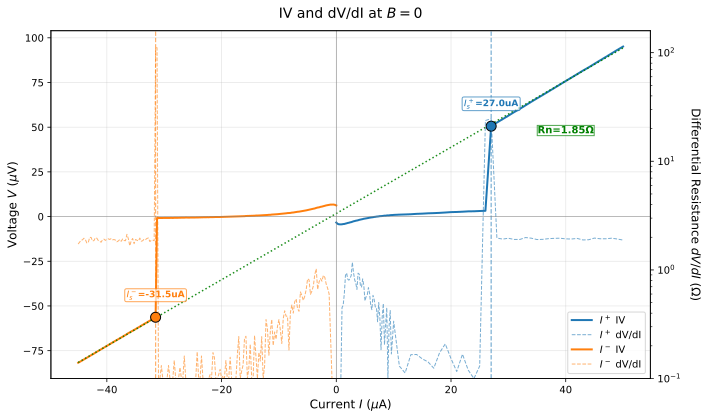

<figcaption>
樣品003-2之正負向切換電流 I-V 特性曲線
</figcaption>
</figure>

[]{#fig-iv-dvdi-comparison} [\[fig-iv-dvdi-comparison\]](#fig-iv-dvdi-comparison){.ref} 是由正負偏壓量測拼接而成的正負向切換電流 I-V 特性曲線。正向切換電流 $I_{s}^{+} \approx 27\text{ µA}$，負向切換電流 $I_{s}^{-} \approx - 33.5\text{ µA}$， $\Delta I_{s} \approx - 6.5\text{ µA}$，$\eta \approx 10.7\%$。雖出現 $I_{s}^{+} \neq \left| I_{s}^{-} \right|$，但此為SQUID樣品003-2的參考接面及目標接面並聯的結果。可能因熱擾動或接面間的微小相位差異所導致，無法直接斷定為約瑟夫森二極體效應。需由之後的電流電壓磁場掃描測量來驗證。

<figure>

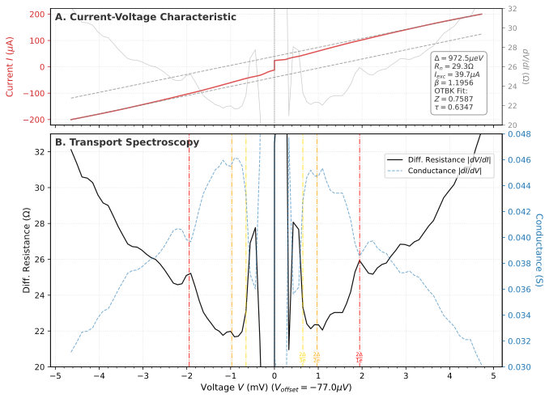

<figcaption>
PtTe2 約瑟夫森接面的直流傳輸特性與多重安德烈夫反射 (MAR)。 (a) 在基溫 (<em>T</em> ≈ 40, mK) 下量測之電流-電壓 (<em>I</em>-<em>V</em>) 特性曲線。接面展現出清晰的超電流分支 (Supercurrent branch)，其切換電流 (Switching current) <em>I</em><em>c</em> ≈ 24, <em>μ</em> A。高偏壓處的過剩電流 (<em>I</em>exc，灰色虛線所示) 顯示該接面具有中透明度的介面特性。 (b) 微分電阻 (<em>d</em><em>V</em>/<em>d</em><em>I</em>) 隨量測電壓 <em>V</em> 的變化曲線。頻譜中展現一系列對應於次諧波能隙結構 (Sub-harmonic gap structures) 的電阻峰。垂直虛線標示了 MAR 特徵峰的理論預期位置 (<em>V</em><em>n</em> = 2<em>Δ</em>/ n<em>e</em>，其中 <em>n</em> = 1, 2, 3)，由此推算出超導能隙 <em>Δ</em> ≈ 0.9725 meV。並以 OBTK 模型的最佳擬合曲線，提取出的介面阻抗參數 <em>Z</em> ≈ 0.7587 與穿透率 <em>τ</em> ≈ 0.6347並以<em>β</em> ≈ 1.1956表示<em>e</em><em>I</em>exc <em>R</em><em>n</em>/<em>Δ</em>。
</figcaption>
</figure>

[]{#fig-MAR} [\[fig-MAR\]](#fig-MAR){.ref} 展示的多重安德烈夫反射（Multiple Andreev Reflection, MAR）特性，為樣品接面品質優良的有力證據，然而因超電流（Supercurrent）過大，無法直接量測到線性電阻區域，即大於 $2\Delta$的範圍。圖中標示的過電流(Excess Current) $I_{\text{excess}}^{+} \approx 42.3\text{ µA}$ 僅能作為大致估計，實際的過電流按趨勢應大於此值。同時，由自熱效應引起的溫升也需加以考慮。 我們在微分電阻 ($dV/dI$) 頻譜 \[圖 1(b)\] 中觀察到顯著的次諧波能隙結構，這提供了電荷傳輸是由多重安德烈夫反射 (MAR) 主導的直接證據。電阻谷的位置與理論公式 $V_{n} = 2\Delta/ne$ 高度吻合，使我們得以確立超導能隙為 $\Delta \approx 0.97\text{ meV}$。為了定量分析介面透明度，我們針對高偏壓數據進行了 Octavio-Tinkham-Blonder-Klapwijk (OBTK) 模型擬合。分析結果顯示介面阻抗參數 $Z \approx 0.76$，對應之穿透率 $\tau \approx 0.63$。此高透明度意味著超電流的限制因素並非來自介面阻障，而是主要源於 $\text{PtTe}_{2}$ 通道內部的擴散散射過程。

值得注意的是，量測所得的 $I_{c}R_{n}$ 積約為 $0.70\text{ mV}$，此數值低於短彈道接面 (Short ballistic junction) 的理論極限 ($I_{c}R_{n} \approx \pi\Delta/2e \approx 1.52\text{ mV}$)。為了釐清此數值的物理起源，我們檢視了元件的特徵長度尺度。給定接面長度 $L = 260\text{ nm}$，我們發現實驗數據與擴散極限 (Diffusive limit) 高度吻合。利用長接面理論公式 $eI_{c}R_{n} \approx 10.82E_{\text{Th}}$ \[Dubos et al., PRB 2001\]，我們提取出的 Thouless 能為 $E_{\text{Th }} \approx 65\mu\text{ eV}$。

由此推算的擴散係數 $D = E_{\text{Th }}L^{2}/\hslash \approx 0.0067\text{ m}^{2}/\text{ s}$，在費米速度 $v_{F} \approx 0.65 \times 10^{6}\text{ m/s}$ 的估算下，對應之平均自由徑 $l_{e} = 3D/v_{F} \approx 31\text{ nm}$。這表明比值 $L/l_{e} \approx 8.4$，確認元件運作於明確的擴散區間 ($L \gg l_{e}$)。此外，擴散相干長度估算為 $\xi_{\text{diff }} = \sqrt{\hslash D/\Delta} \approx 67\text{ nm}$，使得 $L/\xi_{\text{diff }} \approx 4$。這證實了我們的 $\text{PtTe}_{2}$ 接面屬於「長擴散約瑟夫森接面」類別，其超電流大小受限於電子穿越接面所需的擴散時間 (即 Thouless 能)，而非超導能隙。此結果成功解釋了為何在高介面透明度 ($\tau \approx 0.63$) 下，$I_{c}R_{n}$ 數值仍小於短接面理論極限的主因，並展示了 $\text{PtTe}_{2}$ 在擴散長度尺度下仍保有良好的相位同調性。

在高於超導能隙 ($eV > 2\Delta$) 的偏壓區間，我們觀察到微分電阻 ($dV/dI$) 並未如 BCS 理論預期飽和至恆定的正常態電阻 $R_{n}$，而是呈現隨電壓單調上升的趨勢 \[圖 1(b)\]。此現象主要歸因於接面處的焦耳熱效應 (Joule Heating) 累積導致的電子溫度 ($T_{e}$) 升高。在極低溫 ($T \approx 20\text{ mK}$) 環境下，電子-聲子耦合 (electron-phonon coupling) 極弱，導致熱電子難以將能量耗散至晶格。

此外，為了濾除高頻雜訊以優化低溫量測，我們的樣品PCB載台配置了 RC 濾波電路。串聯電阻元件在高注入電流下產生的額外熱量，可能進一步透過基板傳導或準粒子擴散影響接面溫度。這種由熱效應引起的電阻上翹是介觀超導元件測量中常見的非本徵效應 (extrinsic effect)。

## 座標系定義與轉換 (Coordinate System Definition and Transformation) {#section-coordinate-system}

為了精確描述外部磁場與樣品超導特性的關係，我們必須建立實驗室座標系 (Lab Frame) 與樣品座標系 (Sample Frame) 之間的轉換關係。這對於分析非對稱 SQUID 的夫朗和費圖樣以及電流-相位關係 (CPR) 至關重要。

### 實驗室與樣品座標系定義 {#subsection-frames-definition}

1.  **實驗室座標系 (Lab Frame)**：$(X,Y,Z)$

    $X,Y,Z$ 軸由固定於低溫量測系統的由三維向量磁鐵的磁場指向定義。

    - $X$ 軸沿水平方向指向右。

    - $Y$ 軸沿水平方向且垂直於 $X$ 軸指向外側。

    - $Z$ 軸垂直於 $X$ 軸且指向上方軸則與 $X,Y$ 軸共同形成右手座標系。

    - 磁場大小表示為$B_{\text{lab }} = \left( B_{x},B_{y},B_{z} \right)$

2.  **樣品座標系 (Sample Frame)**：$(X',Y',Z')$

    $X',Y',Z'$ 軸由樣品本身的幾何與樣品接面電流方向定義。

    - $X'$ 軸(Longitudinal)：沿樣品長軸方向，即樣品接面內超導電流 $I$ 的流動方向。

    - $Y'$ 軸(Transverse)：沿樣品寬度方向，位於樣品平面內且垂直於電流。

    - $Z'$ 軸(Normal)：垂直於樣品平面的法向量方向。

    - 磁場大小表示為$B_{\text{sample }} = \left( B_{x'},B_{y'},B_{z'} \right)$

### 幾何配置與旋轉角定義 {#subsection-transformation-logic}

在本實驗中，樣品被水平放置於實驗室的 $X - Z$ 平面內，因此樣品平面（$X' - Y'$ 平面）與實驗室 $X - Z$ 平面共面，而樣品法向量 $Z'$ 軸平行於實驗室 $Y$ 軸。

由於樣品在平面內的放置角度並非總是與實驗室主軸對齊，因此引入旋轉角 $\alpha$ 以描述平面內的偏轉。

定義旋轉角 $\alpha$ 為：在實驗室 $X - Z$ 平面中，從實驗室 $+ X$ 軸逆時針旋轉至樣品電流方向（$X'$ 軸）的角度。

### 基底向量與旋轉矩陣 {#subsection-rotation-matrix}

依據上述幾何配置，樣品座標系三個基底向量在實驗室座標系中的表示如下：

$$\begin{array}{r}
\hat{z'} = (0,1,0) \\
\hat{x'} = \left( \cos(\alpha),0,\sin(\alpha) \right) \\
\hat{y'} = \hat{z'} \times \hat{x'} = \left( \sin(\alpha),0, - \cos(\alpha) \right)
\end{array}$$

因此，旋轉矩陣 $R$（由實驗室座標系轉換至樣品座標系）可寫為：

$$R = \begin{pmatrix}
\cos(\alpha) & 0 & \sin(\alpha) \\
\sin(\alpha) & 0 & - \cos(\alpha) \\
0 & 1 & 0
\end{pmatrix}$$ 此旋轉矩陣 $R$ 滿足正交條件 $RR^{T} = I$，且 $\det(R) = 1$，確保此為遵循右手定則。

### 磁場分量轉換 {#subsection-field-component-transform}

實驗室座標系中的磁場 $\mathbf{B_{\text{lab}}} = \left( B_{x},B_{y},B_{z} \right)$ 轉換至樣品座標系之表示式為：

$$\begin{pmatrix}
B_{x'} \\
B_{y'} \\
B_{z'}
\end{pmatrix} = R\begin{pmatrix}
B_{x} \\
B_{y} \\
B_{z}
\end{pmatrix} = \begin{pmatrix}
\cos(\alpha) & 0 & \sin(\alpha) \\
\sin(\alpha) & 0 & - \cos(\alpha) \\
0 & 1 & 0
\end{pmatrix}\begin{pmatrix}
B_{x} \\
B_{y} \\
B_{z}
\end{pmatrix}$$

展開後得：

$$\begin{array}{r}
B_{x'} = B_{x}\cos(\alpha) + B_{z}\sin(\alpha) \\
B_{y'} = B_{x}\sin(\alpha) - B_{z}\cos(\alpha) \\
B_{z'} = B_{y}
\end{array}$$

其中，$B_{z'}$ 代表面外磁場 (Out-of-plane field)，而面內磁場 (In-plane field) 的強度 $B_{\text{In-Plane}}$ 與角度 $\theta$ 則可由 $B_{x'}$ 與 $B_{y'}$ 計算得出：

$$\begin{array}{r}
B_{\text{in-plane }} = \sqrt{B_{x'}^{2} + B_{y'}^{2}} \\
\theta = \arctan(\frac{B_{y'}}{B_{x'}})
\end{array}$$

<figure>

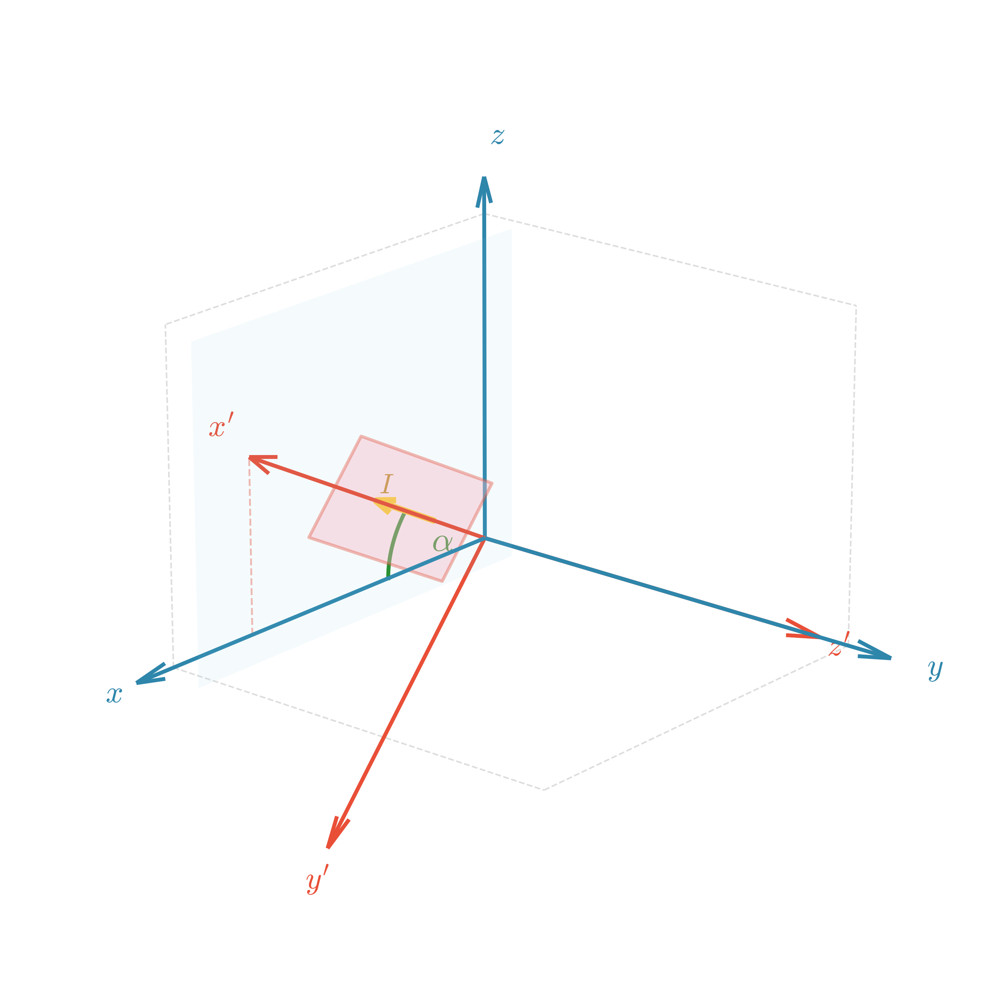

<figcaption>
實驗室座標系 (<em>X</em>, <em>Y</em>, <em>Z</em>)（藍色）與樣品座標系 (<em>X</em>′, <em>Y</em>′, <em>Z</em>′)（紅色）之幾何關係。 樣品平面（粉色矩形）位於 <em>X</em>-<em>Z</em> 平面內，電流方向 <em>X</em>′ 與 <em>X</em> 軸夾角為 <em>α</em>。
</figcaption>
</figure>

[]{#fig-coordinate-system}

### 實例說明：Sample 003-2 {#subsection-example-003-2}

以本章主要分析的樣品 **Sample 003-2** 為例，其安裝角度經校準為 $\alpha = 121.3^{{^\circ}}$。這意味著樣品的電流方向與實驗室 $X$ 軸與 $Z$ 軸之間存在特定的幾何關係，而非單純的平行或垂直。

當我們在實驗室座標系中施加一個磁場向量 $\left( B_{x},B_{y},B_{z} \right)$ 時，其實際作用於樣品的效果必須透過上述轉換關係進行解析。例如，若僅施加實驗室 $X$ 方向的磁場，在樣品座標系中將同時產生沿電流方向（$B_{x'}$）與垂直電流方向（$B_{y'}$）的分量，從而對夫朗和費干涉圖樣與電流相位關係產生複合影響。此一精確的座標轉換對於正確解讀後續章節中的各向異性磁場響應至關重要。

<figure>

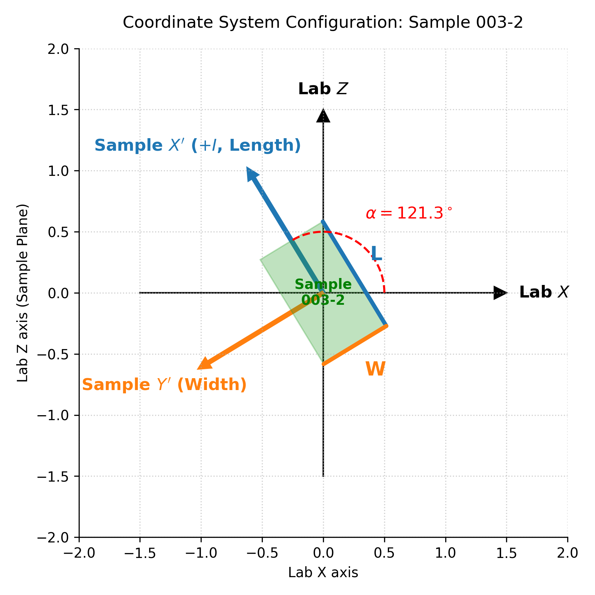

<figcaption>
Sample 003-2 的座標系配置示意圖。樣品位於實驗室 <em>X</em> − <em>Z</em> 平面，逆時針旋轉角度 <em>α</em> = 121.3∘。綠色矩形代表樣品，藍色箭頭指示沿長軸的電流方向（<em>x</em>′ axis）。
</figcaption>
</figure>

[]{#fig-coordinate-system}

### 夫朗和費圖樣 ($B_{\text{in-plane }} = 0$) {#subsection-standard-fraunhofer}

為了探測接面內部超導電流的空間分佈特性，我們量測了切換電流 $I_{s}$ 作為面外磁場 ($B_{z}'$) 函數的調變行為。[\[fig-fraunhofer-heatmap\]](#fig-fraunhofer-heatmap){.ref} 展示了原始的電壓-電流-磁場 (V-I-B) 掃描熱圖，其中深色區域代表零電阻的超導態。接著，我們從中提取出切換電流 $I_{s}$，如 [\[fig-fraunhofer-standard\]](#fig-fraunhofer-standard){.ref} 所示。這構成了在沒有面內磁場 ($B_{\text{in-plane }} = 0$) 時的類夫朗和費干涉圖樣。

<figure>

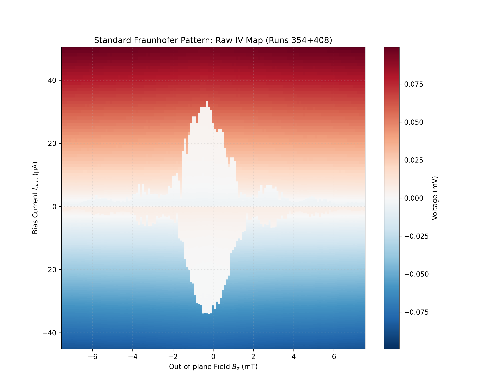

<figcaption>
夫朗和費干涉圖樣的原始量測數據熱圖 (<em>V</em> vs <em>I</em>, <em>B</em><em>z</em>′)。
</figcaption>
</figure>

[]{#fig-fraunhofer-heatmap} [\[fig-fraunhofer-heatmap\]](#fig-fraunhofer-heatmap){.ref} 由003-2樣品的正偏壓（Run 354）與負偏壓（Run 408） 數據合成，展示了清晰的超導區間(白色區域)隨磁場的調變。

<figure>

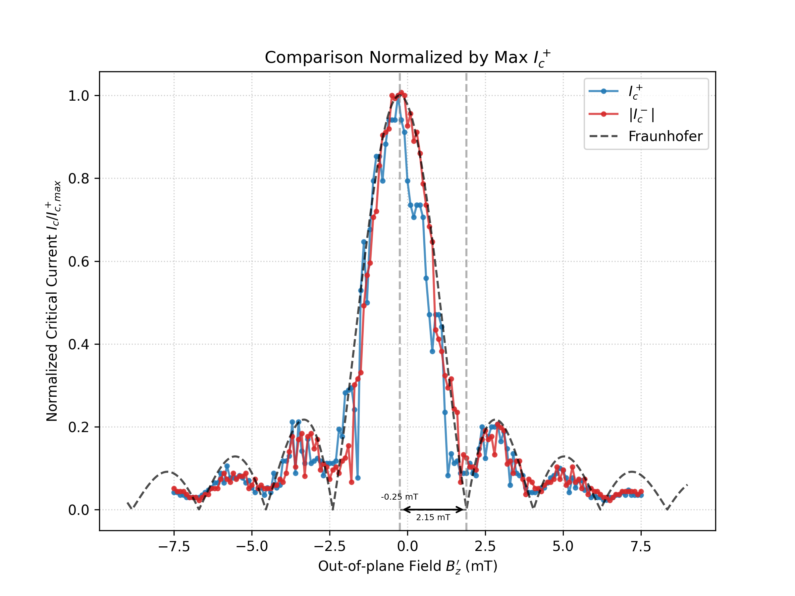

<figcaption>
正規化切換電流 (<em>I</em><em>s</em>) 隨面外磁場 (<em>B</em><em>z</em>′) 的變化。
</figcaption>
</figure>

[]{#fig-fraunhofer-standard} 從原始數據中提取的切換電流 ($I_{s}$) 隨面外磁場 ($B_{z}'$) 的變化，已對 Run 354 最大值進行正規化。灰色垂直虛線標示偏移中心與第一個週期節點，水平箭頭指示週期 $B_{\text{period }} \approx 2.15\text{ mT}$。 類夫朗和費干涉圖樣 ($B_{\text{in-plane }} = 0$)。臨界電流隨面外磁場 ($B_{z}'$) 的變化呈現出類 $|\frac{\sin(\pi\frac{\Phi}{\Phi_{0}})}{\pi\frac{\Phi}{\Phi_{0}}}|$ 的形式。

實驗結果顯示在面外磁場$B_{z}'$約為 0.25 mT 時，切換電流達到最大值 $I_{\text{s, max}}$，第一個極小值節點出現在面外磁場$B_{z}'$約為 1.9 mT 處，但有顯著的節點抬升現象，整個干涉圖樣呈現高度的左右對稱性，且正向切換電流 $I_{c}^{+}$ 與負向切換電流絕對值 $|I_{c}^{-}|$ 的行為幾乎完全重合。

這些特徵表明接面具有均勻的超導電流密度分佈。根據第一個節點的位置，我們可以估算出樣品接面的有效磁學面積： $$A_{\text{eff }} = \frac{\Phi_{0}}{B_{\text{period }}} \approx 2.07 \times \frac{10^{- 15}}{2.15 \times 10^{- 3}} \approx 9.63 \times 10^{- 13}\text{ m}^{2} = 0.963\text{ μm}^{2}$$ 這與由光學顯微鏡測量及AutoCAD軟體計算的樣品接面的幾何面積0.8502675 $\text{μm}^{2}$相當。

### 夫朗和費圖樣隨面內磁場角度的演化 {#subsection-fraunhofer-angle-evolution}

當施加固定面內磁場 ($B_{\text{In-Plane}}$) 時，夫朗和費圖樣隨面內磁場角度發生顯著變化。

<figure>

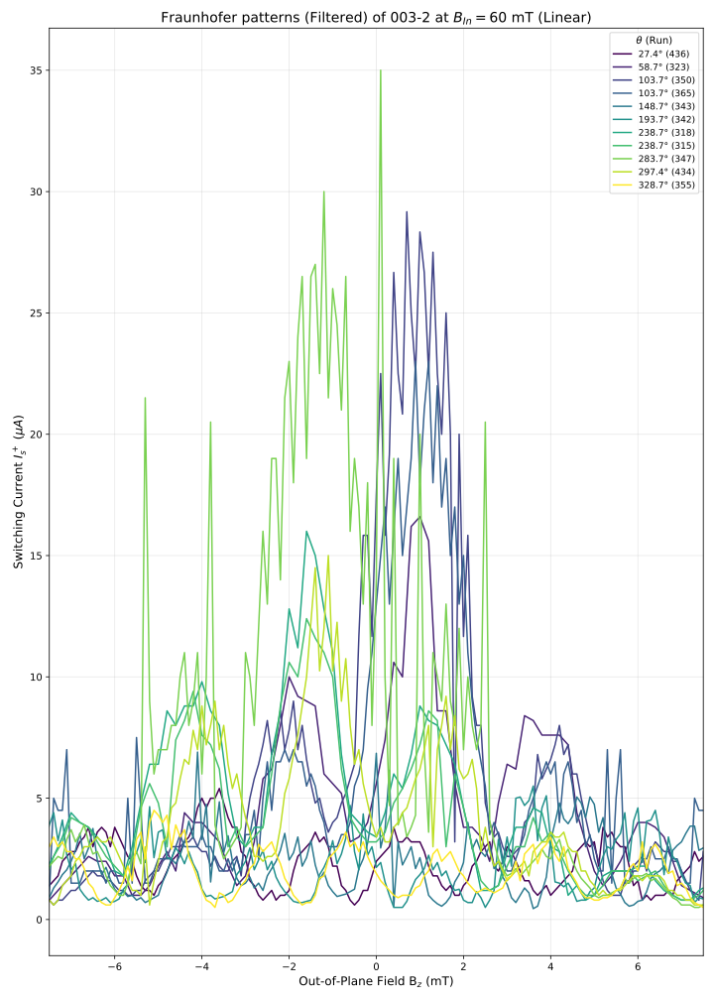

<figcaption>
樣品003-2在面內磁場<em>B</em>In-Plane固定在 60 mT 時，夫朗和費圖樣隨角度 <em>θ</em> 的演化。
</figcaption>
</figure>

[]{#fig-fraunhofer-evolution}

[\[fig-fraunhofer-evolution\]](#fig-fraunhofer-evolution){.ref} 展示了在不同 $\theta$ 值下的干涉圖樣演化，隨著 $\theta$ 的增加，原本對稱的干涉圖樣逐漸變得不對稱，對稱軸位置發生偏移，包絡函數形狀也隨之改變。

<figure>

<figcaption>
樣品005-1在面內磁場<em>B</em>In-Plane固定在 60 mT 時，夫朗和費圖樣隨角度 <em>θ</em> 的演化熱圖。
</figcaption>
</figure>

[]{#fig-fraunhofer-evolution-heatmap}

### 夫朗和費圖樣隨面內磁場強度的演化 {#subsection-fraunhofer-field-evolution}

當施加固定角度的面內磁場 ($B_{\text{In-Plane}}$) 時，夫朗和費圖樣隨面內磁場強度發生顯著變化。

<figure>

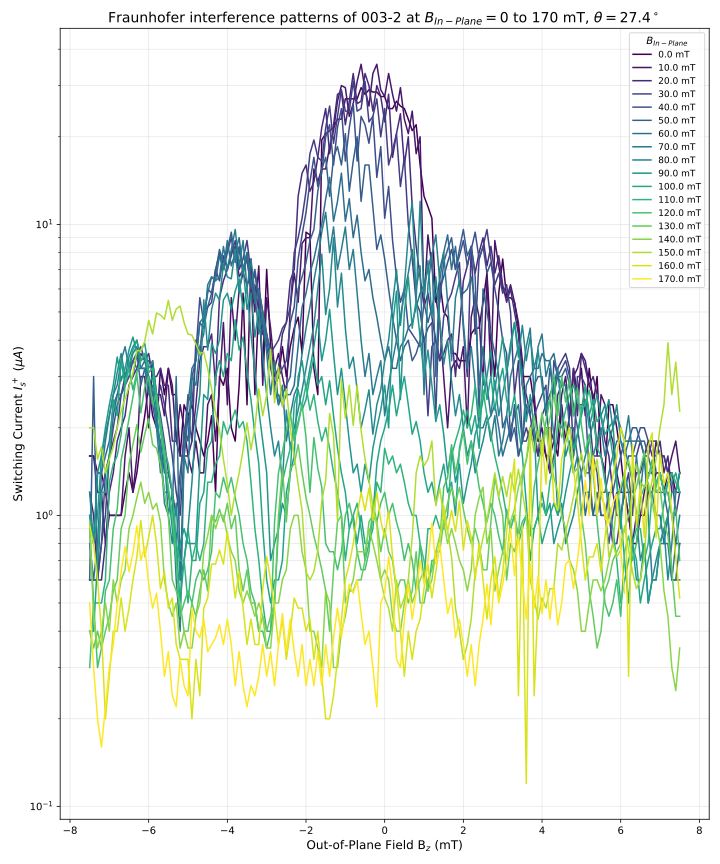

<figcaption>
樣品003-2在面內磁場角度<em>θ</em>固定在 27.4∘ 時，夫朗和費圖樣隨磁場強度<em>B</em>In-Plane的演化。
</figcaption>
</figure>

[]{#fig-fraunhofer-field-evolution-27}

<figure>

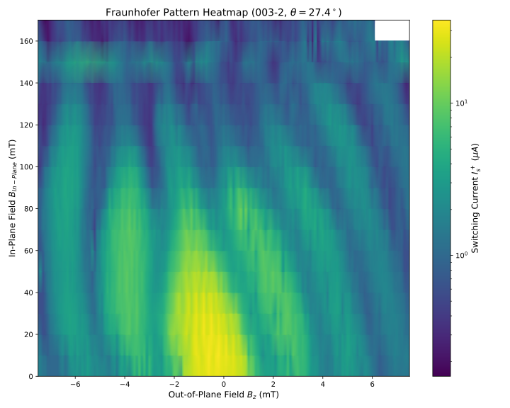

<figcaption>
樣品003-2在面內磁場角度<em>θ</em>固定在 27.4∘ 時，夫朗和費圖樣隨磁場強度<em>B</em>In-Plane的演化熱圖。
</figcaption>
</figure>

[]{#fig-fraunhofer-field-evolution-27-heatmap}

<figure>

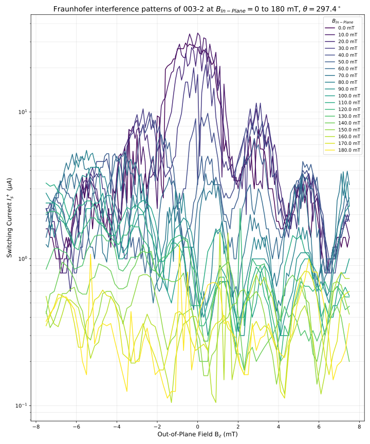

<figcaption>
樣品003-2在面內磁場角度<em>θ</em>固定在 297.4∘ 時，夫朗和費圖樣隨磁場強度<em>B</em>In-Plane的演化。
</figcaption>
</figure>

[]{#fig-fraunhofer-field-evolution-297}

<figure>

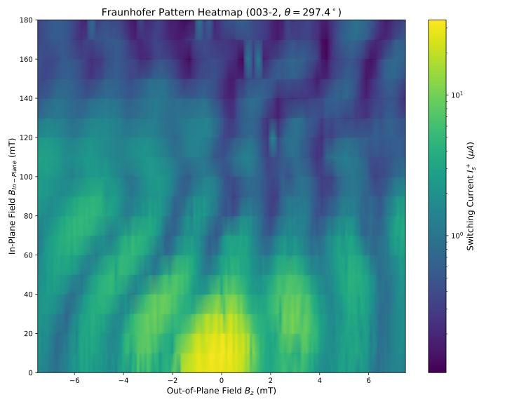

<figcaption>
樣品003-2在面內磁場角度<em>θ</em>固定在 297.4∘ 時，夫朗和費圖樣隨磁場強度<em>B</em>In-Plane的演化熱圖。
</figcaption>
</figure>

[]{#fig-fraunhofer-field-evolution-297-heatmap}

+------------------------------------------------------------+-------------------------------------------------------+
| 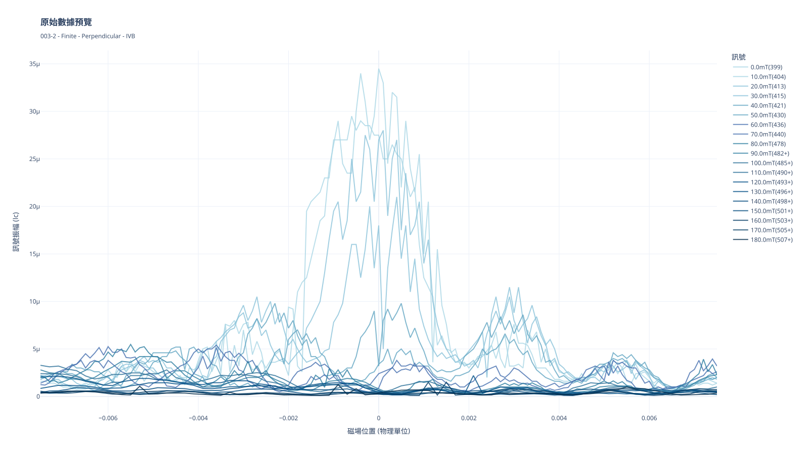 | 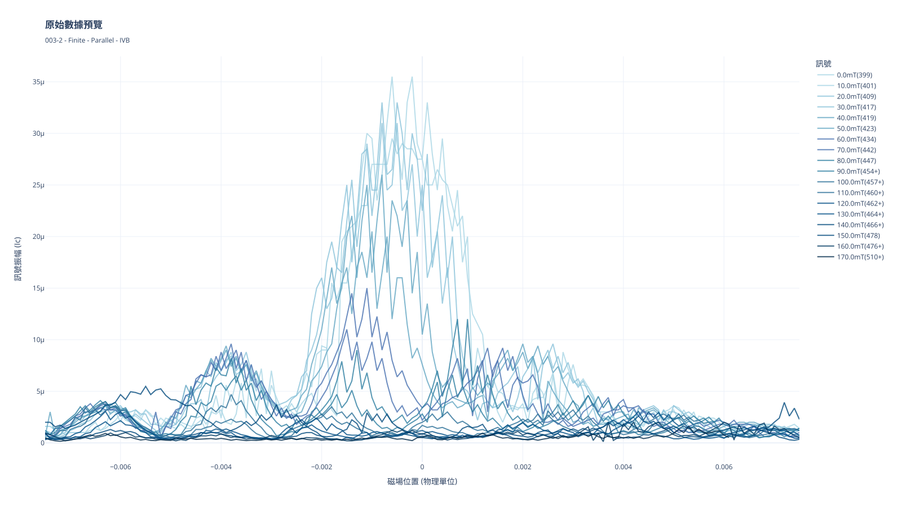 |
+------------------------------------------------------------+-------------------------------------------------------+

: 垂直/平行電流方向磁場下夫朗和費圖樣的演化

[]{#fig-fraunhofer-perpendicular-parallel}

+---------------------------------------------------------------+----------------------------------------------------------+
| 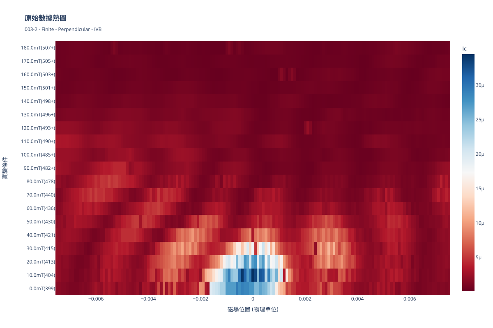 | 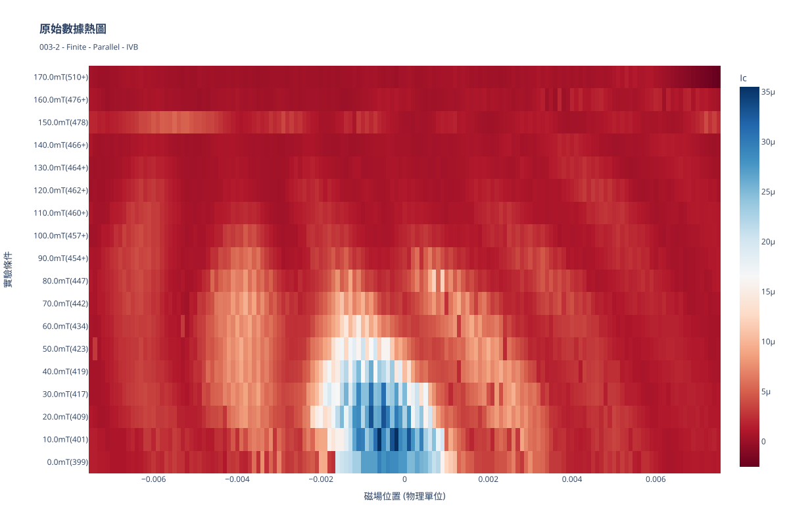 |
+---------------------------------------------------------------+----------------------------------------------------------+

: 垂直/平行電流方向磁場下夫朗和費圖樣的演化熱圖

[]{#fig-fraunhofer-perpendicular-parallel-heatmap}

主要觀察結果包括：

1.  **圖樣不對稱性增加**：隨著 $B_{\text{In-Plane}}$ 的增加，原本高度對稱的夫朗和費圖樣逐漸變得不對對稱

2.  **極小值位置偏移**：干涉圖樣的極小值不再出現在對稱的磁場位置，而是向正或負磁場方向偏移

3.  **包絡函數調變**：整體包絡函數的形狀發生變化，不再嚴格遵循 $\operatorname{sinc}$ 函數

4.  **振幅調變**：不同極小值的深度出現差異，破壞了原有的週期性

這些變化強烈暗示平面內磁場改變了 PtTe₂ 接面的電流-相位關係，可能產生時間反演對稱性破缺。

## 電流-相位關係分析 {#section-cpr-analysis}

### CPR 模型選擇：諧波展開與透明度模型之比較 {#subsection-cpr-model-selection}

最原始的S-I-S約瑟夫森接面的電流相位關係為 $I_{s(\varphi)} = I_{c}\sin(\varphi)$，但在實際的S-N-S系統中可能出現多通道與高階諧波分量，導致 CPR 呈現非純正弦特徵。我們可以用最一般的傅立葉級數展開來描述 CPR，其中包含當時間反演對稱被打破時系統中可能存在的高階諧波和附加相位偏移$\left( \varphi_{n} \right)$： $$I_{s}(\varphi) = \sum_{n = 1}^{\infty}I_{n}\sin(n\varphi + \varphi_{n})$$

這是最廣義的 CPR 表達式。任何週期為 2π 的 CPR 都可以展開成這種傅立葉正弦級數。$I_{n}$ 為第 n 階諧波的振幅。$\varphi_{n}$ 為第 n 階諧波的相位偏移。在時間反演對稱下，所有 $\varphi_{n}$ 為零；非零的 $\varphi_{n}$ 是時間反演對稱破缺的表現。選擇正弦函數是因為約瑟夫森效應的基本關係是正弦型的。高階諧波（n≥2）對應於多重安德烈夫反射過程，即庫珀對（或四重態）的「高階」隧穿。我們選擇將這個 CPR 展開到二階，因為更高階的超電流對總電流的貢獻可以忽略不計。這給出： $$I(\varphi) = I_{1}\sin(\varphi + \varphi_{1}) + I_{2}\sin(2\varphi + \varphi_{2})$$[]{#CPR-general-form} 可以從這個通用 CPR 推導出某些眾所周知的非傳統 CPR 案例。例如令 $\varphi_{1} = \varphi_{2} = 0$，會得到一個僅包含一階和二階諧波項而無任何附加相位的 CPR，對應於典型的 $\varphi$ 接面。在[\[CPR-general-form\]](#CPR-general-form){.ref} 中令 $I_{2} = 0$ 的情況，則會產生具有正弦電流-相位關係的異常約瑟夫森接面或 $\varphi_{0}$ 接面，其相位從零偏移了 $\varphi_{1}$。

現在，不失一般性，$\varphi$ 可以被 $\left( \varphi - \varphi_{1} \right)$ 替換，CPR 可以重寫為：

$$I(\varphi) = I_{1}\sin\varphi + I_{2}\sin(2\varphi + \delta)$$ []{#CPR-with-delta}

其中引入了 $\delta = \varphi_{2} - 2\varphi_{1}$，即一階和二階諧波項之間的相對相位。我們將把具有如[\[CPR-with-delta\]](#CPR-with-delta){.ref} 所示 CPR 的約瑟夫森接面稱為「二階諧波相位差可調$\varphi_{0}$接面」。

在分析電流-相位關係時，我們選擇採用截斷的傅立葉級數模型 ([\[CPR-with-delta\]](#CPR-with-delta){.ref})，而非Kulik-Omelyanchuk模型 ($I(\varphi) \propto \frac{\sin(\varphi)}{\sqrt{1 - \tau\sin^{2}\left( \frac{\varphi}{2} \right)}}$)。此選擇基於以下兩個主要考量：

1.  **極高的透明度要求**：如 [\[fig-cpr-harmonics-tau\]](#fig-cpr-harmonics-tau){.ref} 所示，若要僅透過透明度模型來解釋我們觀察到的顯著二階諧波分量（$\frac{I_{2}}{I_{1}} \approx 0.25$），接面的透明度 $\tau$ 必須達到約 0.90。這是一個非常嚴格的物理條件，通常僅在完美的單原子接觸或極高品質的界面中才能實現。

<figure>

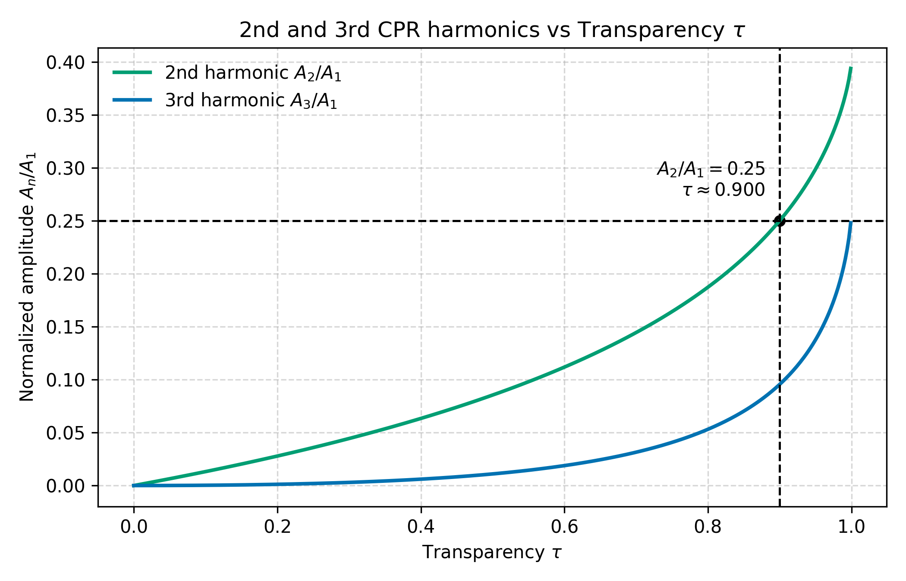

<figcaption>
二階與三階諧波分量隨透明度 <em>τ</em> 的變化。為了產生 $\frac{I_{2}}{I_{1}} = 0.25$ 的二階分量，透明度必須高達 <em>τ</em> ≈ 0.90。
</figcaption>
</figure>

[]{#fig-cpr-harmonics-tau}

2.  **時間反演對稱性的破缺**：標準的Kulik-Omelyanchuk模型通常假設時間反演對稱性，導致 $I_{c}^{+} = |I_{c}^{-}|$（如 [\[fig-cpr-diode-comparison\]](#fig-cpr-diode-comparison){.ref} 綠色曲線所示）。然而，我們的實驗數據顯示明顯的時間反演對稱性的破缺 ($I_{c}^{+} \neq |I_{c}^{-}|$)。為了描述這種時間反演對稱性的破缺，必須引入高階諧波的相位偏移 $\delta$。然而標準的Kulik-Omelyanchuk模型隱含對高階諧波的相位偏移 $\delta$ 的限制，$\delta$必須固定於0。反而簡單的諧波展開模型多了這種自由度（如 [\[fig-cpr-diode-comparison\]](#fig-cpr-diode-comparison){.ref} 紫色曲線所示），能夠靈活地描述此系統。

<figure>

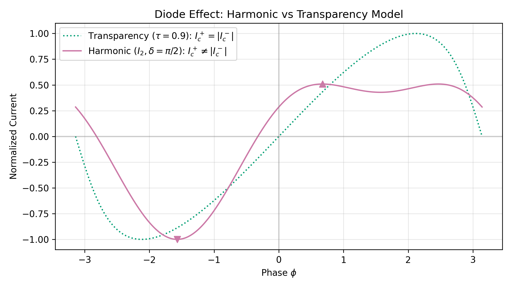

<figcaption>
透明度模型與諧波模型的比較。
</figcaption>
</figure>

[]{#fig-cpr-diode-comparison} 標準Kulik-Omelyanchuk模型 (綠線) 雖然能產生偏斜的波形，但仍保持 $I_{c}^{+} = |I_{c}^{-}|$ 的對稱性。含有相位偏移的諧波模型 (紫線) 則能自然描述 $I_{c}^{+} \neq |I_{c}^{-}|$ 的約瑟夫森二極體效應。 基於上述理由，採用包含相位自由度的諧波展開模型，是對本系統非傳統超導電流特性的更合適描述。

<figure>

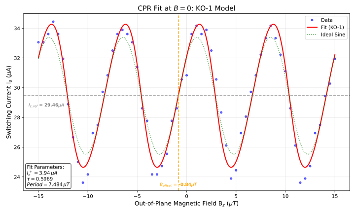

<figcaption>
使用Kulik-Omelyanchuk模型擬合典型 PtTe₂ 約瑟夫森接面的電流相位關係特性曲線
</figcaption>
</figure>

[]{#fig-OK-1-cpr-fit} 使用Kulik-Omelyanchuk模型擬合典型 PtTe₂ 約瑟夫森接面的電流相位關係特性曲線。

在無面內磁場時，使用Kulik-Omelyanchuk模型擬合典型 PtTe₂ 約瑟夫森接面的電流相位關係特性曲線。得出介面透明度為 $\tau \approx 0.6$，屬於中高透明度接面。

<figure>

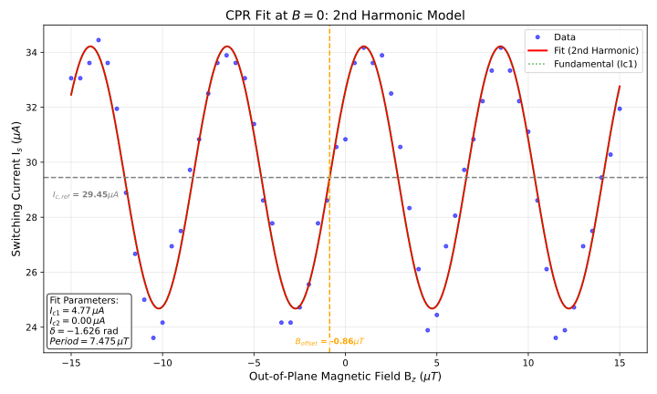

<figcaption>
使用二階諧波相位差可調模型擬合典型 PtTe₂ 約瑟夫森接面的電流相位關係特性曲線
</figcaption>
</figure>

[]{#fig-delta-cpr-fit} 使用二階諧波相位差可調模型擬合典型 PtTe₂ 約瑟夫森接面的電流相位關係特性曲線。

<figure>

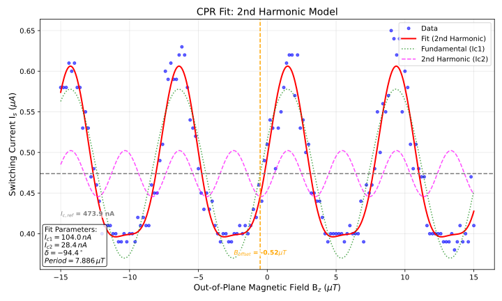

<figcaption>
樣品003-2在面內磁場強度為180 mT，角度為297.4∘的二階諧波相位差可調模型擬合結果
</figcaption>
</figure>

[]{#fig-cpr-fit-508} [\[fig-cpr-fit-508\]](#fig-cpr-fit-508){.ref} 顯示在高面內磁場強度時，二階諧波相位差可調模型能夠很好地擬合實驗數據且二階諧波分量顯著。

### $I_{c}R_{N}$ 乘積估算 {#subsection-icrn-product}

$I_{c}R_{N}$ 乘積是表徵約瑟夫森接面品質的重要參數，它反映了接面的超導能隙與傳輸特性。[\[tab-icrn-statistics\]](#tab-icrn-statistics){.ref} 總結了多個元件的 $I_{c}R_{N}$ 乘積統計資料。

<figure>

Included content from generated_icrn_table.typ

<figcaption>
多個 PtTe₂ 約瑟夫森接面的 <em>I</em><em>c</em><em>R</em><em>N</em> 乘積統計
</figcaption>
</figure>

[]{#tab-icrn-statistics}

#### SQUID 環路電感與自我屏蔽效應評估

為了驗證模型的適用性，我們估算了 SQUID 環路的幾何電感 $L$。對於面積約 $250\text{ µm}^{2}$ 的環路，幾何電感估計為 $L \approx 3$ pH。考量最大臨界電流 $I_{c}^{\text{max }} \approx 100$ µA，計算出的屏蔽參數 $\beta_{L} = 2\pi L\frac{I_{c}}{\Phi_{0}} \approx 0.001$。由於 $\beta_{L} < < 1$，自我屏蔽效應可以忽略，這證實了我們採用顯式 CPR 模型 ($I_{s(\varphi)}$) 而忽略迴路電感影響的合理性。

### CPR 參數隨面內磁場的各向異性演化 {#subsection-cpr-evolution-003-2}

為了探究不同晶體方向上的磁場響應差異，我們針對 Sample 003-2 在兩個特定角度 ($\theta = 27.4^{{^\circ}}$ 與 $297.4^{{^\circ}}$) 進行了細緻的磁場掃描。

+-----------------------------------------------------------------------+------------------------------------------------------------------------+
| 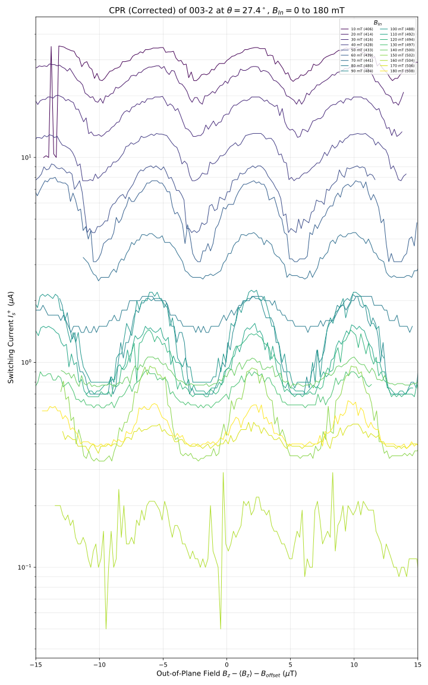{width="95%"} | 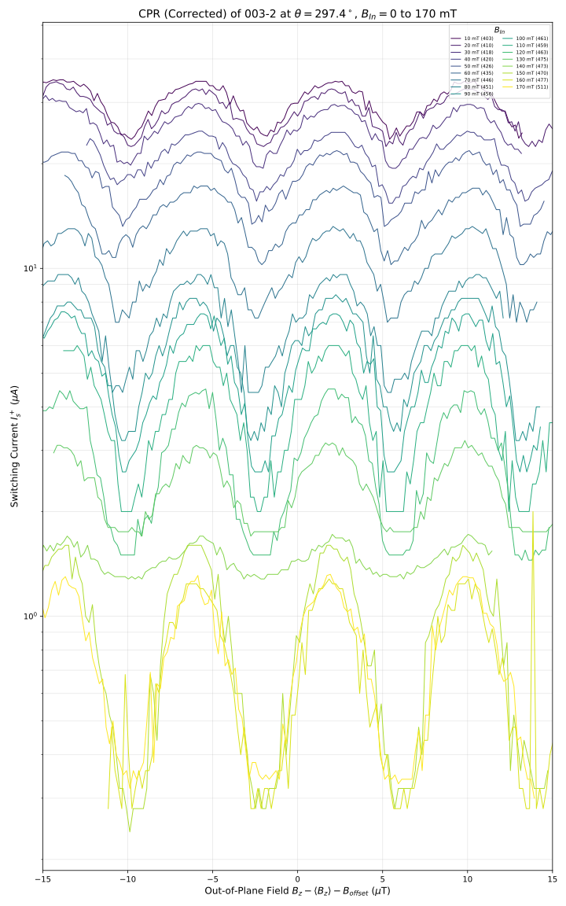{width="95%"} |
+-----------------------------------------------------------------------+------------------------------------------------------------------------+

: 樣品003-2 在特定角度$\theta$下的參數演化 ($27.4^{{^\circ}}$ vs $297.4^{{^\circ}}$)。(左) $\theta = 27.4^{{^\circ}}$。(右) $\theta = 297.4^{{^\circ}}$。

[]{#fig-angle-cpr-evolution}

<figure>

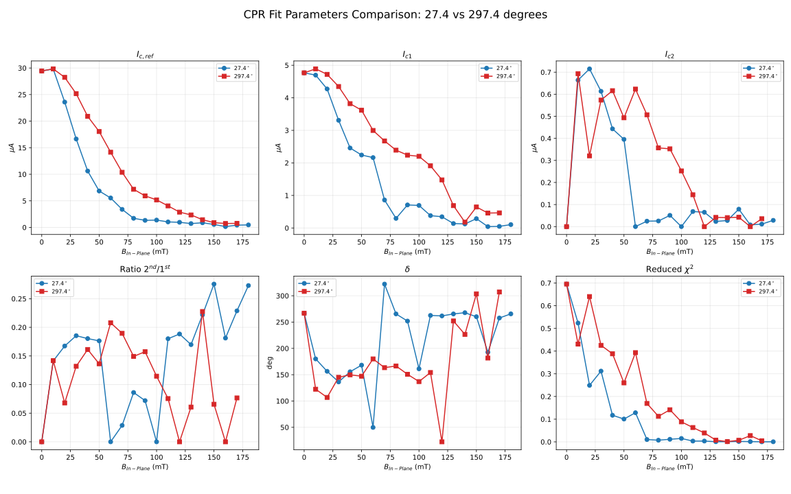

<figcaption>
CPR擬合參數隨面內磁場的演化。
</figcaption>
</figure>

[]{#fig-cpr-fit-parameters-evolution}

[\[fig-cpr-fit-parameters-evolution\]](#fig-cpr-fit-parameters-evolution){.ref} 展示了關鍵數參 ($I_{\text{c, ref}},I_{c1},I_{c2},\frac{I_{c2}}{I_{c1}},\delta,\chi^{2}$) 隨面內磁場強度的演化。從擬合參數的演化可以觀察到參考接面臨界電流 $I_{\text{c,ref}}$、$I_{c1}$、$I_{c2}$ 在不同夾角$\theta$下的面內場$B_{\text{In-Plane}}$作用下的下降趨勢有別，因此可能需要考慮參考介面的面內磁場作用，所以此參數演化統計的可靠性值得商榷，但依然可以從中提取出一些有用的物理現象。在低面內場時，$\frac{I_{c2}}{I_{c1}}$ 與 $\delta$ 的數值較低，擬合誤差也較大，需要提升量測精度，以獲得更準確的結果。然而在高面內場時，$\frac{I_{c2}}{I_{c1}}$ 與 $\delta$ 的數值較高，擬合誤差也較小，二階諧波相位可調模型可以很好地描述現象，但固定夾角$\theta$時的面內場$B_{\text{In-Plane}}$強度與$\frac{I_{c2}}{I_{c1}}$ 和 $\delta$ 的關係並非簡單的線性關係，這可能暗示了更複雜的物理現象，並非完全如 [@sivakumar_long-range_2024] 所述使用Rashba效應與SOC效應造成的自旋-動量耦合現象即可描述，因此樣品目標接面長度更長，面內場$B_{\text{In-Plane}}$更強，需要考慮更多因素。

## 結果總結 {#section-results-summary}

本章的實驗結果確立了以下重要發現：

1.  **高品質的 PtTe₂ 約瑟夫森接面**：成功製備了具有清晰超導特性和良好電學性能的元件。

2.  **非傳統的電流-相位關係**：直接觀測到包含顯著二階諧波分量的非純正弦 CPR。

3.  **高面內磁場下的顯著二階諧波分量與相位差**：觀察到高面內磁場下的 CPR 中二階諧波分量與相位差的顯著變化，這表明了磁場對 CPR 的調控作用。

這些結果為理解 PtTe₂ 中的非傳統的電流-相位關係提供了直接的實驗證據，並展示了利用外部磁場調控量子元件特性的巨大潛力。

# 討論 {#chapter-discussion}

## 直接量測電流相位關係探討非對稱夫朗和費干涉圖樣的起源 {#section-asymmetric-fraunhofer-origin}

不同於使用量測正負向切換電流計算切換電流差 $\Delta I_{s}$間接得出電流相位關係的方式，本研究使用$\text{PtTe}_{2}$構成的非對稱SQUID直接量測電流相位關係，從而提供了深入理解非對稱夫朗和費（Fraunhofer）干涉圖樣的起源內在物理機制的重要線索。

## 製備技術挑戰 {#section-fabrication-challenges}

在$\text{PtTe}_{2}$基礎超導元件的製備過程中，遇到了多項技術挑戰，這些挑戰直接影響了最終元件的電學特性與量測結果的可靠性。

### 薄片尺寸與厚度控制 {#subsection-flake-size-thickness}

二維材料薄片（Flake）的尺寸與厚度控制是影響元件性能的關鍵因素。機械剝離法（Mechanical Exfoliation）獲得的$\text{PtTe}_{2}$薄片在尺寸分佈和厚度均勻性方面存在固有的變異性。

### 過渡金屬二硫屬化物表面保護與殘留物清除 {#subsection-tmd-surface-protection}

過渡金屬二硫屬化物（Transition Metal Dichalcogenide, TMD）材料表面的保護與清潔是確保高品質歐姆接觸（Ohmic Contact）的重要步驟。在電子束微影（Electron Beam Lithography, EBL）與後續製程中，如何有效保護材料表面並完全清除製程殘留物是製備成功的關鍵。

### 濺鍍超導電極的側壁問題 {#subsection-sputtered-leads-sidewall}

磁控濺鍍（Magnetron Sputtering）製程中的側壁沉積問題會影響電極圖案的精確度與電學特性。特別是在製備細線寬的超導電極時，側壁效應可能導致短路或產生非預期的電流路徑。

### SQUID環路面積與接面尺寸的匹配 {#subsection-squid-area-flake-size}

在製備非對稱SQUID時，SQUID環路面積與接面尺寸的匹配是影響量測精度的重要因素，較大的SQUID環路面積與接面尺寸比可以得到較佳的參考接面相位鎖定效果，但對磁場的控制精度要求較高。本研究提供了一個初步結果，為後續研究與樣品幾何設計提供了重要的參考。

### 長接面與高面內磁場下的顯著二階諧波分量與相位差 {#subsection-long-flake-high-field}

在長接面與高面內磁場下，我們觀察到顯著的二階諧波分量與相位差，這隱含約瑟夫森二極體效應出現的可能，但在高面內磁場下，接面臨界電流密度分布的不均勻性造成夫浪和斐干涉圖樣已經嚴重扭曲，此時原始的二極體效率定義是否適用值得商榷。

# 結論與展望 {#chapter-conclusion-prospect}

## 結論 {#section-conclusion}

本研究成功地實現了對第二類狄拉克半金屬 (Type-II Dirac Semimetal) 1T-PtTe₂ 基超導量子干涉儀 (Superconducting Quantum Interference Device, SQUID) 中磁通量控制電流-相位關係 (flux-controlled current-phase relation) 的深入探索。透過結合精密的元件製備技術、極低溫量測平台以及先進的數據分析方法，我們獲得了以下重要的研究成果：

### 主要研究成果 {#subsection-main-achievements}

1.  **高品質的介面接觸**：

    - 成功製備了高品質的金屬-半金屬接觸界面，實現了超導量子干涉儀元件的高可靠性

2.  **非傳統電流-相位關係的直接觀測**：

    - 成功製備了基於 1T-PtTe₂ 的平面型超導量子干涉儀元件

    - 透過非對稱 SQUID 量測技術，直接重構出 PtTe₂ 約瑟夫森接面 (Josephson Junction) 的電流-相位關係

    - 確認了電流-相位關係顯著偏離傳統的正弦函數形式 $I_{s} = I_{c}\sin(\varphi)$，展現出明顯的高階諧波分量

3.  **磁通量調控特性的系統性研究**：

    - 展示了外部磁通量對電流-相位關係形式的連續調控能力

    - 實現了「可調控的 $\varphi_{0}$-約瑟夫森接面」功能，其中 $\varphi_{0}$ 相位偏移可透過磁場進行原位調節

    - 驗證了元件作為磁通量可調諧超導量子元件的應用潛力

### 技術創新與方法學貢獻 {#subsection-technical-innovations}

1.  **精密製備技術**：

    - 建立了完整的二維材料機械剝離 (mechanical exfoliation) 到超導元件製備的技術流程

    - 開發了有效的介面清潔與原位離子束蝕刻 (in-situ ion milling) 技術，確保高品質的金屬-半金屬接觸

    - 實現了奈米級精度的電子束微影 (electron beam lithography) 圖案定義

2.  **量測方法學**：

    - 搭建了整合式的毫開爾文溫度極低溫量測平台

    - 改良基於 QCoDeS 框架的自動化數據擷取與分析系統以實現正負向電流與平面內磁場的控制與量測

    - 發展了從非對稱 SQUID 干涉圖樣重構電流-相位關係的分析方法

## 展望 {#section-prospect}

基於本研究的重要發現和建立的技術基礎，未來的研究方向具有廣闊的發展空間：

### 短期研究方向 {#subsection-short-term-prospects}

1.  **元件性能優化**：

    - 進一步優化製備工藝，提高接面的均勻性和可重現性

    - 探索不同厚度 PtTe₂ 薄片對電流-相位關係的影響

    - 改良樣品幾何結構設計以取得量測精度與速度的平衡

    - 替換參考接面材料以排除其對目標接面電流-相位關係的影響

2.  **物理機制深入研究**：

    - 透過溫度依賴性量測深入理解拓撲表面態與超導配對的競爭與協作關係

    - 研究磁場方向性對約瑟夫森二極體效應的影響

    - 探索閘極電壓對接面電流-相位關係的影響

3.  **量測技術拓展**：

    - 加入夏皮羅階梯 (Shapiro steps) 量測技術以研究接面的量子漲落機制

### 中長期研究方向 {#subsection-long-term-prospects}

1.  **新型量子元件開發**：

    - 基於可調控 $\varphi_{0}$-接面開發拓撲保護的量子位元 (topologically protected qubits)

    - 設計具有內建相位偏移的超導量子干涉元件，實現免磁場的量子態操控

    - 探索 PtTe₂ 基約瑟夫森接面在超導量子計算中的應用潛力

2.  **材料體系拓展**：

    - 探索其他狄拉克/外爾半金屬 (如 WTe₂、MoTe₂) 中的類似現象

    - 研究異質結構 (如 PtTe₂/石墨烯) 中的介面超導與拓撲效應

    - 開發基於范德瓦耳斯異質結構 (van der Waals heterostructures) 的可調控超導元件

### 科學影響與意義 {#subsection-scientific-impact}

本研究不僅在基礎物理層面揭示了拓撲材料與超導性的深刻交互作用，更為未來量子技術的發展提供了重要的材料平台和物理基礎。隨著量子計算、量子感測等領域的快速發展，具有內稟拓撲保護和可調控特性的超導元件將發揮越來越重要的作用。

## 結語 {#section-concluding-remarks}

本研究成功地展示了 1T-PtTe₂ 基超導量子干涉儀中磁通量控制電流-相位關係的豐富物理內涵。所獲得的非傳統電流-相位關係和約瑟夫森二極體效應[@sivakumar_long-range_2024]，不僅加深了我們對拓撲超導物理的理解，也為開發新一代量子元件奠定了重要基礎。

這項研究體現了材料科學、凝聚態物理和量子工程等多學科交叉融合的力量。透過將新興拓撲量子材料與成熟的超導技術相結合[@hsueh_investigating_2024]，我們不僅發現了新的物理現象，更開闢了通向未來量子技術的新途徑。

隨著相關研究的不斷深入和技術的持續發展，相信基於拓撲材料的超導量子元件將在推動量子科技革命中發揮關鍵作用，為人類社會帶來前所未有的技術變革和應用可能。

# 參考文獻 {background-color="#40666e"}

::: {#refs}
:::
